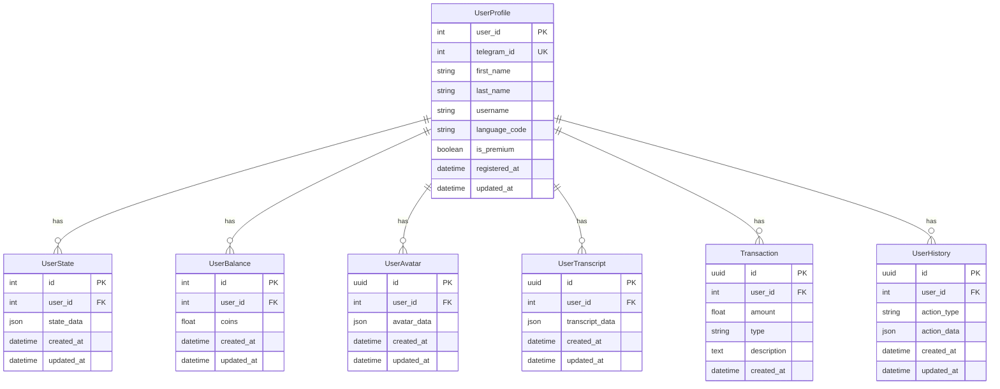

# Архитектура проекта

> **Внимание! Все модели БД определяются только в `database/models.py`. Импорты моделей — только `from database.models import ...`. Дублирующих моделей в других папках быть не должно.**

## Общая структура

Проект построен по принципу чистой архитектуры с разделением на слои:

1. **Presentation Layer** (Telegram Bot)
   - Обработчики команд
   - Клавиатуры
   - Форматирование сообщений
   
   > **Важно:** Хендлеры регистрируются в порядке специфичности:
   > 1. Специфичные хендлеры (например, в transcribe.py) регистрируются первыми
   > 2. Общие хендлеры (например, в general.py) регистрируются последними
   > 3. Избегаем дублирования хендлеров для одних и тех же команд/кнопок

2. **Service Layer** (Бизнес-логика)
   - UserService
   - AvatarService
   - TranscriptService
   - BalanceService
   - HistoryService

3. **Repository Layer** (Доступ к данным)
   - UserRepository
   - UserStateRepository
   - UserBalanceRepository
   - UserAvatarRepository
   - UserTranscriptRepository
   - TransactionRepository
   - UserHistoryRepository

4. **Data Layer**
   - PostgreSQL (основное хранилище)
   - MinIO (файловое хранилище)

## База данных

> **Основная рабочая база данных: `aisha`. Имя и параметры подключения задаются через .env и alembic.ini.**

### Схема данных



### Индексы

1. **UserProfile**
   - `idx_user_telegram_id` (UNIQUE) на `telegram_id`
   - `idx_user_username` на `username`

2. **UserState**
   - `idx_user_state_user_id` на `user_id`

3. **UserBalance**
   - `idx_user_balance_user_id` на `user_id`

4. **UserAvatar**
   - `idx_user_avatar_user_id` на `user_id`
   - `idx_user_avatar_created_at` на `created_at`

5. **UserTranscript**
   - `idx_user_transcript_user_id` на `user_id`
   - `idx_user_transcript_created_at` на `created_at`

6. **Transaction**
   - `idx_transaction_user_id` на `user_id`
   - `idx_transaction_created_at` на `created_at`

7. **UserHistory**
   - `idx_user_history_user_id` на `user_id`
   - `idx_user_history_action_type` на `action_type`
   - `idx_user_history_created_at` на `created_at`

### Ограничения

1. **UserBalance**
   - `check_coins_positive`: coins >= 0

2. **Transaction**
   - `check_transaction_type`: type IN ('credit', 'debit')

3. **UserHistory**
   - `check_action_type`: action_type IN ('avatar_created', 'transcript_created', 'balance_updated', 'transaction_created')

4. **Внешние ключи**
   - Все внешние ключи настроены с `

## Хранение транскриптов
- Все транскрипты (текстовые и аудио) хранятся только в MinIO (bucket transcripts).
- Кэш последних транскриптов пользователя реализован через таблицу user_transcript_cache (user_id, path=minio_key, created_at).
- Локальные файлы не используются для доступа к транскриптам.
- Все сервисы и хендлеры работают только с MinIO-ключами и кэшем.
- Для получения текста транскрипта используется download_file(bucket, minio_key) по ключу из кэша.

## Аватары: хранение и обработка

- Все состояния и метаданные аватаров хранятся в PostgreSQL (user_avatars, user_avatar_photos)
- Все фото аватаров — только в MinIO (bucket avatars/)
- Предпросмотр и галерея работают через выборку из user_avatar_photos и скачивание из MinIO
- Нет локальных json-файлов, нет legacy FSM
- Все сервисы асинхронные, работают через SQLAlchemy AsyncSession

### Галерея аватаров

- Вся логика галереи реализована в одном модуле (handlers/avatar/gallery.py) с использованием единой функции и клавиатуры.
- Старые (legacy) функции и клавиатуры галереи полностью удалены из проекта.
- Все обработчики используют новую функцию и клавиатуру, поддерживается прогрессбар, рекомендации, навигация, кнопки "⭐", "✏️", "🗑", "В меню", "Продолжить", "Отменить".
- Для расширения галереи добавляйте новые кнопки и логику только в новую функцию и клавиатуру.
- Подписи к фото (caption) формируются через get_gallery_caption с прогрессбаром и рекомендациями.

## Управление состоянием (FSM)

### Архитектура
1. Все состояния хранятся в PostgreSQL через `StateRepository`
2. Каждая операция с состоянием требует `AsyncSession`
3. Состояния привязаны к UUID пользователя, а не к Telegram ID

### Компоненты
1. `StateRepository` - работа с БД
2. `state_utils.py` - утилиты для работы с состоянием
3. `StateType` - типы состояний (str или Dict[str, Any])

### Правила использования
1. Всегда передавать `session` в функции:
   - `set_state(user_id, state, session)`
   - `get_state(user_id, session)`
   - `clear_state(user_id, session)`
2. Использовать UUID вместо Telegram ID
3. Логировать все изменения состояния
4. Обрабатывать ошибки БД

### Примеры состояний
```python
class States:
    MAIN_MENU = "main_menu"
    AVATAR_CREATE = "avatar_create"
    AVATAR_EDIT = "avatar_edit"
    AVATAR_CONFIRM = "avatar_confirm"
    AVATAR_ENTER_NAME = "avatar_enter_name"
    TRANSCRIBE_TXT = "transcribe_txt"
    TRANSCRIBE_AUDIO = "transcribe_audio"
```

### Миграция состояний
1. Все состояния хранятся в PostgreSQL
2. Используется `StateRepository` для CRUD операций
3. Поддерживается обратная совместимость через алиасы

### FSM для аватаров

#### Состояния
1. `avatar_create` - начало создания аватара
2. `avatar_photo_upload` - загрузка фото
3. `avatar_type_select` - выбор типа аватара
4. `avatar_enter_name` - ввод имени
5. `avatar_confirm` - подтверждение создания
6. `avatar_edit` - редактирование аватара

#### Переходы
1. `avatar_create` → `avatar_photo_upload`
   - Триггер: команда создания аватара
   - Валидация: проверка прав пользователя
   
2. `avatar_photo_upload` → `avatar_type_select`
   - Триггер: загрузка достаточного количества фото
   - Валидация: проверка фото в MinIO
   
3. `avatar_type_select` → `avatar_enter_name`
   - Триггер: выбор типа аватара
   - Валидация: проверка существования аватара
   
4. `avatar_enter_name` → `avatar_confirm`
   - Триггер: ввод имени
   - Валидация: проверка формата имени
   
5. `avatar_confirm` → `main_menu`
   - Триггер: подтверждение создания
   - Валидация: проверка всех данных аватара
   
6. `avatar_edit` → `avatar_photo_upload`
   - Триггер: команда редактирования
   - Валидация: проверка прав на редактирование

#### Валидация
1. На каждом этапе проверяется:
   - Существование аватара в БД
   - Принадлежность аватара пользователю
   - Наличие фото в MinIO
   - Корректность состояния аватара

2. Используются функции:
   - `validate_avatar_exists()` - проверка в БД
   - `validate_avatar_photos()` - проверка в MinIO
   - `validate_avatar_state()` - проверка состояния

3. Обработка ошибок:
   - Логирование всех ошибок
   - Информативные сообщения пользователю
   - Возврат в предыдущее состояние при ошибке

#### Безопасность
1. Все операции с аватарами требуют:
   - Аутентификации пользователя
   - Проверки прав доступа
   - Валидации входных данных
   
2. Защита от:
   - Неавторизованного доступа
   - Изменения чужих аватаров
   - Потери данных при сбоях

## Клавиатуры
- Все клавиатуры, связанные с аватарами (выбор типа, этап загрузки, подтверждение, галерея и др.), размещаются только в `frontend_bot/keyboards/avatar.py`.
- В `frontend_bot/keyboards/common.py` остаются только универсальные клавиатуры (например, отмена, подтверждение, если используются в разных сценариях).
- Импорты обновлять при переносе.

## Буферизация фото через Redis

- Для устранения race condition и поддержки многопроцессного режима используется Redis-буфер для фото.
- Все фото, пришедшие до появления аватара в БД, временно сохраняются в Redis (ключ `photo_buffer:{user_id}`) с TTL 5 минут.
- После создания аватара FSM автоматически обрабатывает все фото из Redis-буфера.
- При отмене визарда буфер очищается.
- Используется централизованный асинхронный клиент Redis (`frontend_bot/shared/redis_client.py`), параметры берутся из `.env` через Pydantic-конфиг.
- Нет потери фото при рестарте процесса, поддерживается горизонтальное масштабирование.
- Ограничения: Redis должен быть доступен, TTL буфера — 5 минут (можно изменить).

### Схема работы:
1. Пользователь запускает визард создания аватара.
2. Если фото приходят до появления аватара — они буферизуются в Redis.
3. После создания аватара FSM забирает все фото из Redis и обрабатывает их.
4. При отмене визарда или завершении сессии буфер очищается.

### Best practices:
- Все параметры Redis централизованы в конфиге.
- Нет дублирования in-memory и Redis-буфера.
- Для production рекомендуется мониторинг Redis и настройка лимитов/TTL.

## [avatar] Разделение функций загрузки фото

- Вся бизнес-логика загрузки и сохранения фото реализуется только в сервисе: `frontend_bot/services/avatar_workflow.py::handle_photo_upload`.
- В хендлерах не должно быть функций с таким же именем! Для шагов визарда используйте thin-обёртки с уникальными именами (например, `handle_photo_upload_show_menu`).
- Любая обработка буфера, валидация, сохранение — только через сервис.
- Это исключает дублирование и путаницу между слоями.

## [storage] Централизация работы с MinIO

- Все сервисы и хендлеры используют только `frontend_bot/services/minio_client.py` для работы с MinIO (upload, download, delete, generate_presigned_url, check_file_exists).
- Прямое создание Minio-клиента (`Minio(...)`) и импорты из других модулей (например, shared_storage.storage_utils) запрещены.
- В тестах допускается прямой клиент или мок.
- Это обеспечивает единый интерфейс, асинхронность и простоту поддержки.

## Работа с MinIO

- Вся работа с MinIO (загрузка, скачивание, удаление файлов, генерация presigned URL и т.д.) осуществляется только через модуль `frontend_bot/services/minio_client.py`.
- Прямое создание клиентов Minio, дублирующие singleton-обёртки и альтернативные точки входа запрещены.
- Все сервисы и обработчики должны использовать только функции и клиент из этого модуля.
- В тестах и скриптах допускается создание отдельного клиента Minio для изолированных нужд.

### Удаление legacy

- Файл `shared_storage/storage_utils.py` удалён как устаревший (legacy).
- Вся работа с MinIO (загрузка, скачивание, удаление, presigned URL и т.д.) ведётся только через модуль `frontend_bot/services/minio_client.py`.