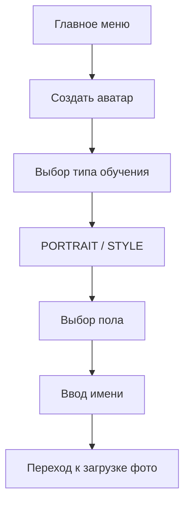
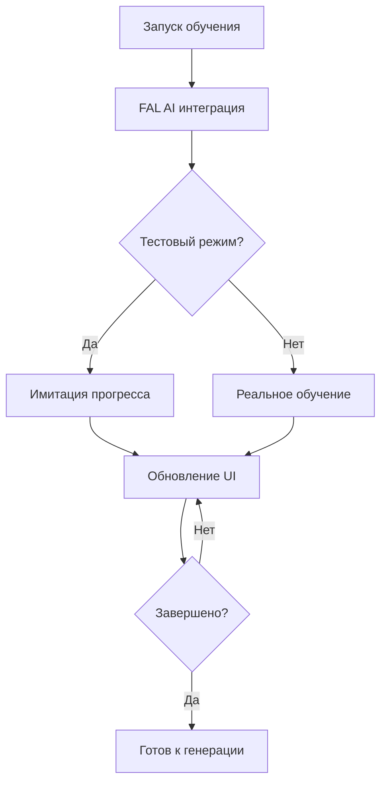

# 🎭 Консолидированная архитектура системы аватаров

## 📋 Обзор

Полная архитектура системы создания и обучения аватаров с интеграцией FAL AI, включающая все типы обучения и продакшн-готовый функционал.

---

## 🏗️ СТРУКТУРА КОМПОНЕНТОВ

### 📁 Handlers (Обработчики)
```
app/handlers/avatar/
├── __init__.py                    # Роутер и регистрация
├── main.py                        # Главное меню аватаров
├── create.py                      # Создание аватара
├── training_type_selection.py     # Выбор типа обучения
├── photo_upload.py                # Загрузка фотографий
└── training_production.py         # Обучение (продакшн)
```

### 🎹 Keyboards (Клавиатуры)
```
app/keyboards/
├── avatar_clean.py                # Основные клавиатуры аватаров
└── photo_upload.py                # Клавиатуры загрузки фото
```

### 🔧 Services (Сервисы)
```
app/services/
├── avatar_db.py                   # Основной сервис аватаров
├── photo_upload_service.py        # Загрузка фотографий
└── avatar/
    └── training_service.py        # Сервис обучения FAL AI
```

### 🗄️ Database (База данных)
```
app/database/
├── models.py                      # Модели Avatar, AvatarPhoto
└── repositories/
    └── avatar.py                  # Репозиторий аватаров
```

---

## 🎯 WORKFLOW СИСТЕМЫ

### Фаза 1: Создание аватара


### Фаза 2: Загрузка фотографий
```mermaid
graph TD
    A[Загрузка фото] --> B[Валидация]
    B --> C[Сохранение в MinIO]
    C --> D[Обновление счетчика]
    D --> E{Достаточно фото?}
    E -->|Да| F[Кнопка "Начать обучение"]
    E -->|Нет| A
```

### Фаза 3: Обучение


---

## 📊 МОДЕЛИ ДАННЫХ

### Avatar (Основная модель)
```python
class Avatar(Base):
    __tablename__ = "avatars"
    
    # Идентификация
    id: UUID (PK)
    user_id: UUID (FK)
    
    # Основные данные
    name: str
    gender: AvatarGender           # male, female, other
    avatar_type: AvatarType        # character, style, custom
    training_type: AvatarTrainingType  # portrait, style ⭐ НОВОЕ
    
    # Статус и прогресс
    status: AvatarStatus           # draft, uploading, ready, training, completed, error, cancelled
    training_progress: int         # 0-100%
    
    # FAL AI интеграция
    finetune_id: str              # ID обучения в FAL
    fal_mode: str                 # "portrait" или "style"
    
    # Данные и конфигурация
    avatar_data: JSON
    training_config: JSON
    photos_count: int
    
    # Временные метки
    created_at: DateTime
    updated_at: DateTime
```

### AvatarPhoto (Фотографии)
```python
class AvatarPhoto(Base):
    __tablename__ = "avatar_photos"
    
    # Идентификация
    id: UUID (PK)
    avatar_id: UUID (FK)
    user_id: UUID (FK)
    
    # Файл
    minio_key: str                # Путь в MinIO
    file_hash: str                # Для дедупликации
    file_size: int
    
    # Валидация
    validation_status: PhotoValidationStatus  # pending, valid, invalid, duplicate
    has_face: bool
    quality_score: float
    
    # Метаданные
    width: int
    height: int
    photo_metadata: JSON
    
    # Временные метки
    created_at: DateTime
    updated_at: DateTime
```

---

## 🎨 ТИПЫ ОБУЧЕНИЯ

### 🎭 PORTRAIT (Портретный)
**Алгоритм:** Flux LoRA Portrait Trainer
- **Назначение:** Специализация на лицах людей
- **Время обучения:** 3-15 минут
- **Особенности:**
  - Автоматическая обрезка портретов
  - Создание масок лица
  - Оптимизация для портретной съемки
  - Лучшее качество для человеческих лиц

### 🎨 STYLE (Художественный)
**Алгоритм:** Flux Pro Trainer
- **Назначение:** Универсальные стили и объекты
- **Время обучения:** 5-30 минут
- **Особенности:**
  - Поддержка любых стилей
  - Обучение на объектах и концепциях
  - Максимальная универсальность
  - Подходит для нестандартных задач

---

## 🔄 СОСТОЯНИЯ FSM

### Основные состояния (22 штуки)
```python
class AvatarStates(StatesGroup):
    # Создание аватара
    selecting_avatar_type = State()
    selecting_gender = State()
    entering_name = State()
    
    # Выбор типа обучения
    selecting_training_type = State()
    confirming_training_type = State()
    
    # Загрузка фотографий
    uploading_photos = State()
    viewing_photo_gallery = State()
    confirming_photos = State()
    
    # Обучение
    confirming_training = State()
    training_in_progress = State()
    training_completed = State()
    training_cancelled = State()
    
    # Галерея и управление
    avatar_gallery = State()
    avatar_details = State()
    editing_avatar = State()
    deleting_avatar = State()
    
    # Дополнительные
    viewing_training_comparison = State()
    photo_validation_error = State()
    insufficient_photos = State()
    training_error = State()
```

---

## 🔗 ИНТЕГРАЦИЯ С FAL AI

### AvatarTrainingService
```python
class AvatarTrainingService(BaseService):
    """Сервис обучения аватаров через FAL AI"""
    
    async def start_training(self, avatar_id: UUID) -> bool:
        """Запуск обучения с выбранным типом"""
        avatar = await self.get_avatar(avatar_id)
        
        if avatar.training_type == AvatarTrainingType.PORTRAIT:
            return await self._train_portrait_model(avatar)
        else:
            return await self._train_style_model(avatar)
    
    async def _train_portrait_model(self, avatar):
        """Flux LoRA Portrait Trainer"""
        # Специализированное обучение портретов
        
    async def _train_style_model(self, avatar):
        """Flux Pro Trainer"""
        # Универсальное художественное обучение
```

### Режимы работы
- **🔴 Продакшн:** Реальные вызовы FAL AI API
- **🧪 Тестовый:** Имитация прогресса (скрыта от пользователей)

---

## 🎹 ПОЛЬЗОВАТЕЛЬСКИЙ ИНТЕРФЕЙС

### Основное меню аватаров
```
🎭 Меню аватаров

Ваши аватары: 3
┌─────────────────────┐
│ 🆕 Создать аватар   │
│ 📁 Мои аватары (3)  │
│ ℹ️ Помощь           │
│ ◀️ Главное меню     │
└─────────────────────┘
```

### Выбор типа обучения
```
🎓 Выберите тип обучения

┌─────────────────────┐
│ 🎭 Портретный       │
│   (рекомендуемый)   │
│                     │
│ 🎨 Художественный   │
│   (универсальный)   │
│                     │
│ 📊 Сравнить типы    │
│ ◀️ Назад            │
└─────────────────────┘
```

### Загрузка фотографий
```
📸 Загрузка фотографий

Загружено: 7/10 фото
Мин. требуется: 10

┌─────────────────────┐
│ 📷 Добавить фото    │
│ 🖼️ Просмотр (7)     │
│ 💡 Советы качества  │
│ ◀️ Назад            │
└─────────────────────┘
```

### Процесс обучения
```
🤖 Обучение аватара

📊 Прогресс: 65%
⚡ Статус: В процессе...

⏱️ Продолжаем обучение...

┌─────────────────────┐
│ ⏸️ Отменить         │
└─────────────────────┘
```

---

## 🛡️ БЕЗОПАСНОСТЬ И ВАЛИДАЦИЯ

### Валидация фотографий
- **Формат:** JPEG, PNG
- **Размер:** Мин. 512x512, макс. 10MB
- **Содержание:** Проверка на наличие лиц
- **Дедупликация:** Хеширование для исключения дублей

### Ограничения пользователей
- **Максимум аватаров:** 10 на пользователя
- **Лимит фотографий:** 50 на аватар
- **Частота обучения:** 1 параллельное обучение

### Обработка ошибок
- **Graceful degradation** при недоступности FAL AI
- **Rollback состояний** при критических ошибках
- **Пользовательские сообщения** об ошибках

---

## 📈 МОНИТОРИНГ И МЕТРИКИ

### Логирование
```python
logger.info(f"🎭 Создан аватар {avatar_id} пользователем {user_id}")
logger.info(f"📸 Загружено {photo_count} фотографий для аватара {avatar_id}")
logger.info(f"🚀 Запущено обучение аватара {avatar_id} типа {training_type}")
logger.info(f"🧪 ТЕСТОВЫЙ РЕЖИМ: Имитация обучения аватара {avatar_id}")
```

### Метрики для мониторинга
- Количество созданных аватаров
- Успешность обучений
- Время обучения по типам
- Ошибки интеграции с FAL AI

---

## 🚀 ГОТОВНОСТЬ К ПРОДАКШЕНУ

### ✅ Реализовано
- **Полный workflow** создания аватаров
- **Два типа обучения** (PORTRAIT, STYLE)
- **Загрузка и валидация** фотографий
- **Интеграция FAL AI** с fallback режимом
- **Мониторинг прогресса** в реальном времени
- **Профессиональный UX** без технических деталей

### 🔄 Требуется для продакшена
- Настройка FAL API ключей
- Конфигурация webhook endpoints
- Мониторинг и алерты
- Масштабирование для нагрузки

---

**🎉 Система аватаров готова к использованию пользователями!** 