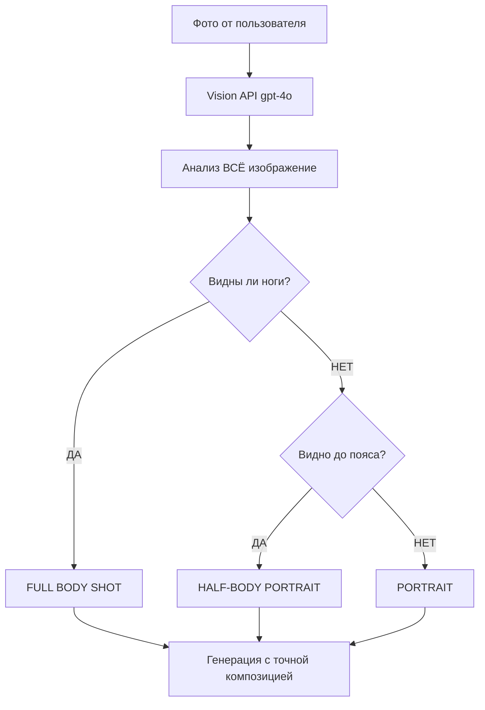

# 🎯 Критическое исправление: Точное определение типа кадра

## 🐛 Проблема
Бот продолжал генерировать **крупные планы** даже для фото в полный рост, не повторяя композицию исходного изображения.

**Пример проблемы:**
- **Исходное фото**: Азиат в смокинге стоит в полный рост (full body shot)
- **Результат**: Портрет крупным планом (portrait/half-body)
- **Проблема**: Неправильное определение типа кадра в Vision API анализе

## ✅ Решение: Революционная система определения кадра

### 🎯 Новая логика анализа кадра:

```
📐 FULL BODY SHOT (ПРИОРИТЕТ!) - используй ВСЕГДА если видно:
• Полная фигура от головы до ног (даже если ноги частично обрезаны)
• Человек стоит в полный рост
• Видно туловище + большую часть ног
• Общий план с человеком в окружении

📐 HALF-BODY PORTRAIT - используй только если:
• Четко видно от головы до пояса/бедер
• Руки видны полностью или частично  
• НЕ видно ноги совсем

📐 PORTRAIT - используй ТОЛЬКО если:
• Видны ТОЛЬКО голова и плечи
• Классический портретный кадр
```

### 🚨 Критические правила:

1. **ПРИОРИТЕТ ШИРОКИХ КАДРОВ**: При сомнениях всегда выбирай более широкий тип
2. **ОБЯЗАТЕЛЬНАЯ ПРОВЕРКА**: "Вижу ли я ноги?" → Если ДА = FULL BODY SHOT
3. **ТОЧНОЕ ПОВТОРЕНИЕ**: Анализировать ВСЁ изображение перед определением типа

## 🔧 Технические изменения

### 📱 Улучшенный системный промпт:
```python
# ОБЯЗАТЕЛЬНАЯ ПОСЛЕДОВАТЕЛЬНОСТЬ АНАЛИЗА КАДРА:
1. Сначала ВНИМАТЕЛЬНО изучи ВСЁ ИЗОБРАЖЕНИЕ - что именно видно?
2. Определи границы видимости тела:
   - Видны ли НОГИ человека? (хотя бы частично)
   - Видно ли ТУЛОВИЩЕ ПОЛНОСТЬЮ от головы до пояса?
   - Видны ли ТОЛЬКО голова и плечи?

# КРИТИЧЕСКОЕ ПРАВИЛО:
🚨 ВСЕГДА выбирай БОЛЕЕ ШИРОКИЙ тип кадра при сомнениях!
Если видишь человека стоящего - это FULL BODY SHOT, даже если ноги слегка обрезаны!
```

### 📊 Примеры правильного определения:

**ДО исправления:**
```
❌ "portrait of an Asian businessman" 
   (для фото в полный рост)
```

**ПОСЛЕ исправления:**
```
✅ "full body shot of a sophisticated Asian gentleman in formal black tuxedo"
   (точно повторяет композицию исходного фото)
```

## 🎯 Результат

### ✅ Что исправлено:
- **Точное определение кадра**: Full body для полных планов, half-body для торса, portrait только для голов
- **Приоритет широких кадров**: При сомнениях выбираем более широкую композицию
- **Детальная проверка**: Пошаговый анализ видимости тела
- **Примеры в промпте**: Конкретные образцы для каждого типа кадра

### 🚀 Практический эффект:
- **Азиат в смокинге в полный рост** → генерируется как full body shot
- **Деловой портрет по пояс** → генерируется как half-body portrait  
- **Крупный план головы** → генерируется как portrait

## 🔄 Workflow нового анализа



## 🎉 Готовность к тестированию

- ✅ Системный промпт обновлен с детальными инструкциями
- ✅ Добавлены примеры для каждого типа кадра
- ✅ Приоритет отдается широким кадрам
- ✅ Пошаговая проверка видимости тела
- ✅ Совместимость с LoRA и FLUX Pro моделями

**Следующий шаг**: Тестирование с фото азиата в смокинге для подтверждения генерации full body shot. 