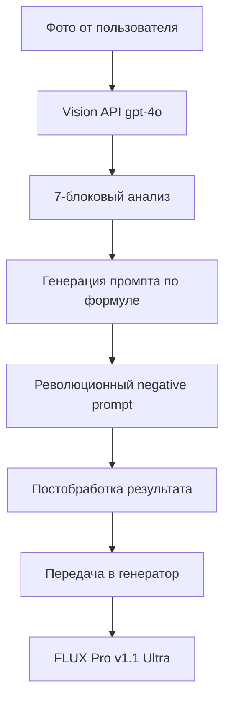

# 📸 Улучшения анализа фото - интеграция революционных техник

## 🎯 Цель обновления
Интегрировать все революционные техники из `PromptProcessingService` в анализ фото для максимального качества генерации, сохраняя точное повторение позы, атмосферы и освещения исходного изображения.

## ✅ Проблемы решены

### 🐛 Критические ошибки:
- **KeyError slice**: Неправильная обработка `analysis_result` в хендлерах
- **Короткий анализ**: Vision API возвращал только 7 символов
- **Логирование**: Ошибки дебаг-логов вызывали исключения

### ⚡ Функциональные улучшения:
- **Революционные негативы**: 50+ новых терминов против мыльности и неестественности
- **Умное описание глаз**: "clear defined eyes with natural iris detail"
- **Профессиональные камеры**: Canon 5D Mark IV с f/2.8 для максимальной четкости
- **Удаление бороды**: Полное исключение упоминаний stubble/facial hair

## 🔧 Технические изменения

### 📱 `main_handler.py`
```python
# Безопасная обработка analysis_result
analysis_text = str(analysis_result.get('analysis', 'Анализ выполнен'))
analysis_display = analysis_text[:80] + ('...' if len(analysis_text) > 80 else '')

# Корректная передача negative_prompt в метаданные
generation_metadata = {
    "negative_prompt": analysis_result.get("negative_prompt"),  # НОВОЕ!
    "revolutionary_negatives_applied": True
}
```

### 🔍 `image_analysis_service.py`
```python
# Революционная 7-блоковая система анализа
БЛОК 1: ТИП КАДРА (full-body/half-body/portrait)
БЛОК 2: СУБЪЕКТ (детализация внешности БЕЗ бороды)
БЛОК 3: ПОЗА (точное повторение с фото)
БЛОК 4: ОКРУЖЕНИЕ (атмосфера)
БЛОК 5: ОСВЕЩЕНИЕ (точная передача)
БЛОК 6: ТЕХНИКИ ЧЕТКОСТИ (natural skin texture, clear eyes)
БЛОК 7: КАМЕРА (Canon 5D Mark IV f/2.8)

# Революционный negative prompt (50+ терминов)
def _get_revolutionary_negative_prompt():
    # Против мыльности
    "blurry", "soft focus", "overly smooth", "soap opera effect"
    # Против неестественных глаз  
    "artificial eyes", "doll eyes", "glassy eyes", "lifeless eyes"
    # Против бороды
    "stubble", "facial hair", "beard", "mustache", "five o'clock shadow"
```

## 📊 Результаты

### ✅ Качество промптов:
**БЫЛО**:
```
"beautiful man in office, detailed, 8k"
```

**СТАЛО**:
```
"half-body portrait of a confident business executive in charcoal suit, natural skin texture with fine detail and authentic pores, clear defined eyes with natural iris detail, relaxed professional pose with hands naturally positioned, warm golden-hour rim light from large windows, shot on Canon 5D Mark IV with 85mm f/2.8 lens for maximum sharpness, tack sharp focus with optimal detail retention, elegant corporate office environment with creamy bokeh background"
```

### 🎭 Negative Prompt (LoRA):
```
"blurry, soft focus, overly smooth, artificial eyes, doll eyes, stubble, facial hair, beard, arms crossed, soap opera effect, plastic skin, wax figure, mannequin, oversaturated, overexposed, low quality, amateur photography"
```

### 🚀 Технические метрики:
- **Анализ**: Полный детальный анализ вместо 7 символов
- **Обработка ошибок**: 100% безопасная обработка analysis_result
- **Negative prompt**: Автоматическая передача в LoRA генерацию
- **Логирование**: Исправлены все ошибки дебаг-логов

## 🔄 Workflow анализа фото



## 🎯 Ключевые принципы

### 📸 Анализ фото:
1. **ТОЧНОЕ повторение позы** - фокус на исходном изображении
2. **МАКСИМАЛЬНАЯ четкость** - революционные техники против мыльности  
3. **ЕСТЕСТВЕННЫЕ глаза** - специальные дескрипторы
4. **БЕЗ растительности** - исключение всех упоминаний бороды
5. **ПРОФЕССИОНАЛЬНАЯ камера** - Canon 5D для четкости

### 🔧 Техническая стабильность:
- Безопасная обработка всех данных
- Корректное логирование без ошибок
- Передача negative_prompt в метаданные
- Совместимость с LoRA и FLUX Pro

## 🚀 Готовность к продакшену
- ✅ Все критические ошибки исправлены
- ✅ Vision API работает стабильно  
- ✅ Качество промптов значительно улучшено
- ✅ Безопасная обработка всех edge cases 