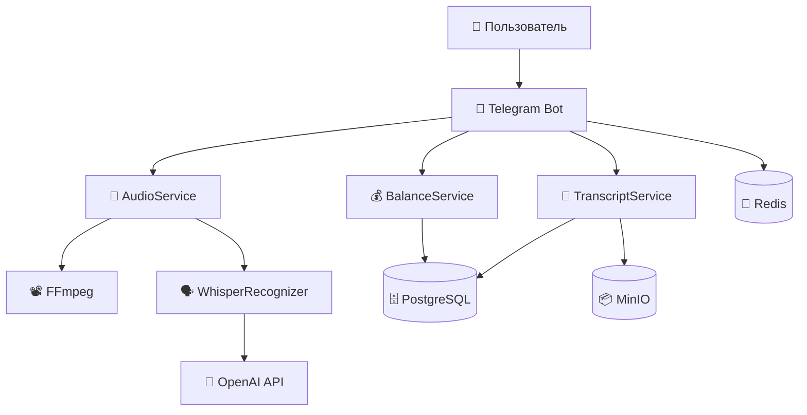

# 🤖 Aisha Bot v2 - Документация

> **Статус проекта:** ✅ Активная разработка  
> **Версия:** 2.0  
> **Последнее обновление:** Декабрь 2024

## 🚀 Быстрый старт

### Что это?
Современный Telegram-бот для транскрибации голосовых сообщений с использованием OpenAI Whisper API и системой платных услуг.

### ✨ Основные возможности
- 🔊 **Транскрибация аудио** - Преобразование голосовых сообщений в текст
- 💰 **Платная система** - Система балансов для оплаты транскрибации  
- 📝 **Сохранение результатов** - Персональная галерея транскриптов
- ⚡ **Smart chunking** - Умное разбиение длинных аудио на части
- 🔄 **Асинхронная обработка** - Быстрая обработка через aiogram 3.x

### 🏃‍♂️ Быстрый запуск

```bash
# 1. Клонирование и настройка
git clone <repo> && cd aisha-backend
cp env.docker.template .env
# Отредактируйте .env с вашими ключами

# 2. Запуск контейнеров
docker-compose -f docker-compose.bot.dev.yml up -d --build

# 3. Проверка
docker-compose -f docker-compose.bot.dev.yml logs -f aisha-bot-dev
```

## 📁 Структура документации

### 📖 Основные руководства
- **[Архитектура](architecture.md)** - Техническая архитектура проекта
- **[Развертывание](DEPLOYMENT.md)** - Полное руководство по развертыванию
- **[Best Practices](best_practices.md)** - Стандарты разработки

### 🔧 Разработка
- **[Планирование](PLANNING.md)** - Текущие планы развития
- **[Задачи](TASK.md)** - Активные задачи
- **[Система платежей](PAYMENT_SYSTEM.md)** - Документация по балансам

## 🛠️ Технический стек

### Backend
- **Python 3.12** - Основной язык
- **aiogram 3.4.1** - Telegram Bot API
- **aiohttp 3.9.5** - HTTP клиент (зафиксированная версия)
- **SQLAlchemy 2.0** - ORM (async)
- **Alembic** - Миграции БД

### Audio Processing
- **ffmpeg** - Конвертация и обработка аудио
- **OpenAI Whisper API** - Транскрибация речи
- **pydub** - Python библиотека для аудио

### Infrastructure
- **PostgreSQL** - Основная БД
- **Redis** - Кеширование и очереди
- **MinIO** - Файловое хранилище S3-совместимое
- **Docker** - Контейнеризация

## 🏗️ Архитектура



### Основные компоненты

- **🤖 Telegram Bot** - Обработка пользовательских сообщений
- **🎵 AudioService** - Обработка аудио файлов
- **🗣️ WhisperRecognizer** - Транскрибация через OpenAI
- **💰 BalanceService** - Управление балансами
- **📝 TranscriptService** - Сохранение результатов
- **🗄️ PostgreSQL** - Основная база данных
- **🔴 Redis** - Кеширование и очереди
- **📦 MinIO** - Файловое хранилище

## 🚀 Развертывание

### Development
```bash
# Локальная разработка
docker-compose -f docker-compose.bot.dev.yml up -d --build
```

### Production (планируется)
```bash
# Docker развертывание
docker-compose -f docker-compose.prod.yml up -d
```

Подробнее: [Руководство по развертыванию](DEPLOYMENT.md)

## 📋 Рабочие процессы

### Транскрибация аудио
1. Пользователь отправляет голосовое сообщение
2. Конвертация в MP3 через ffmpeg
3. Разбиение на чанки (60 секунд)
4. Транскрибация каждого чанка через OpenAI
5. Склеивание результатов
6. Сохранение в MinIO и PostgreSQL

### Система оплаты
1. Проверка длительности аудио
2. Расчет стоимости (15 монет/минута)
3. Проверка баланса пользователя
4. Списание средств при достаточном балансе
5. Транскрибация или предложение пополнения

## 🔍 Мониторинг и логи

- **Логи приложения**: Структурированное логирование с уровнями
- **Логи транскрибации**: Детальное отслеживание процесса
- **Healthcheck**: Проверка состояния всех компонентов
- **Метрики**: Планируется добавление Prometheus

## 💳 Система тарификации

### Цены
- **Бесплатно**: 3 минуты в день
- **Платно**: 15 монет за минуту

### Функции платежей
- Проверка баланса перед транскрибацией
- Автоматическое списание средств
- История транзакций
- Возврат средств при ошибках

## 🆘 Поддержка

### Частые проблемы
- **Контейнер перезапускается**: Проверьте токены в .env
- **Транскрибация зависает**: Проверьте OpenAI API ключ
- **Ошибки подключения**: Убедитесь в доступности PostgreSQL/Redis

### Получение помощи
- Проверьте логи контейнеров
- Изучите документацию по архитектуре
- Создайте issue с описанием проблемы

---

**Создано с ❤️ командой Aisha Bot** | **Статус:** ✅ Активная разработка 