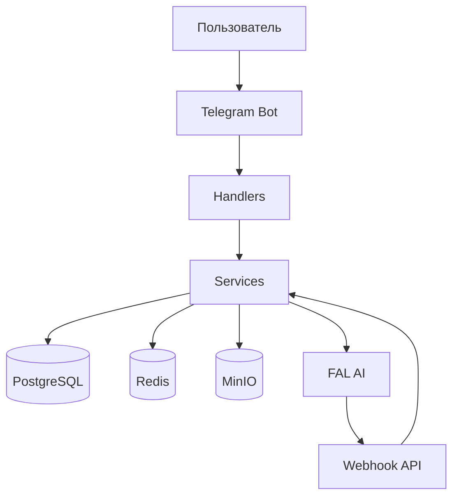

# 🤖 Aisha Bot v2 - Документация

> **Статус проекта:** ✅ Production Ready  
> **Версия:** 2.0  
> **Последнее обновление:** Декабрь 2024

## 🚀 Быстрый старт

### Что это?
Современный Telegram-бот для создания AI-аватаров и генерации изображений с использованием FAL AI и передовых ML технологий.

### ✨ Основные возможности
- 🎭 **AI-аватары** - Создание персональных аватаров с обучением на ваших фото
- 🎨 **Генерация изображений** - Создание изображений по текстовому описанию
- 📸 **Фото-анализ** - Генерация по референсному изображению
- 🖼️ **Галерея** - Управление созданными аватарами и изображениями
- ⚙️ **Настройки** - Персонализация опыта использования

### 🏃‍♂️ Быстрый запуск

```bash
# 1. Клонирование и настройка
git clone <repo> && cd aisha-backend
python -m venv .venv && source .venv/bin/activate
pip install -r requirements.txt

# 2. Конфигурация
cp env.example .env
# Отредактируйте .env с вашими ключами

# 3. База данных
alembic upgrade head

# 4. Запуск
python -m app.main
```

## 📁 Структура документации

### 📖 Основные руководства
- **[Архитектура](architecture.md)** - Техническая архитектура проекта
- **[Развертывание](setup/DEPLOYMENT.md)** - Полное руководство по развертыванию
- **[Best Practices](best_practices.md)** - Стандарты разработки

### 🔧 Разработка
- **[Планирование](PLANNING.md)** - Текущие планы развития
- **[Задачи](TASK.md)** - Активные задачи
- **[Troubleshooting](reference/troubleshooting.md)** - Решение проблем

### 🎯 Функциональность
- **[Система аватаров](features/)** - Подробно о создании аватаров
- **[Генерация изображений](features/)** - Процесс генерации
- **[FAL AI интеграция](reference/fal_knowlege_base/)** - База знаний FAL AI

## 🛠️ Технический стек

### Backend
- **Python 3.11+** - Основной язык
- **aiogram 3.x** - Telegram Bot API
- **FastAPI** - Webhook API сервер
- **SQLAlchemy 2.0** - ORM (async)
- **Alembic** - Миграции БД

### Infrastructure
- **PostgreSQL** - Основная БД
- **Redis** - Кэширование и очереди
- **MinIO** - Файловое хранилище
- **Docker** - Контейнеризация

### AI/ML Services
- **FAL AI** - Обучение аватаров и генерация
- **OpenAI** - Обработка текста (планируется)

## 🏗️ Архитектура



### Основные компоненты

- **🎯 Handlers** - Обработка команд пользователей
- **⚙️ Services** - Бизнес-логика
- **🗄️ Database** - Хранение данных
- **📁 Storage** - Файловое хранилище
- **🔄 Webhook** - Асинхронная обработка

## 🚀 Развертывание

### Development
```bash
# Локальная разработка
source .venv/bin/activate
python -m app.main
```

### Production
```bash
# Docker развертывание
docker-compose -f docker-compose.prod.yml up -d
```

Подробнее: [Руководство по развертыванию](setup/DEPLOYMENT.md)

## 📋 Рабочие процессы

### Создание аватара
1. Пользователь выбирает тип аватара
2. Загружает 5-20 фотографий
3. Система обучает модель через FAL AI
4. Аватар готов к генерации

### Генерация изображений
1. Выбор аватара или кастомный промпт
2. Выбор параметров (размер, стиль)
3. Генерация через FAL AI
4. Результат в галерее

## 🔍 Мониторинг и логи

- **Логи приложения**: `app.log`
- **Логи бота**: `bot.log`
- **Healthcheck**: `/health` endpoint
- **Метрики**: Через логи (планируется Prometheus)

## 🆘 Поддержка

### Частые проблемы
- [Troubleshooting Guide](reference/troubleshooting.md)
- [FAQ по FAL AI](reference/fal_knowlege_base/README.md)

### Разработка
- [Contribution Guidelines](best_practices.md)
- [Code Style](best_practices.md#code-style)

---

**Создано с ❤️ командой Aisha Bot** 