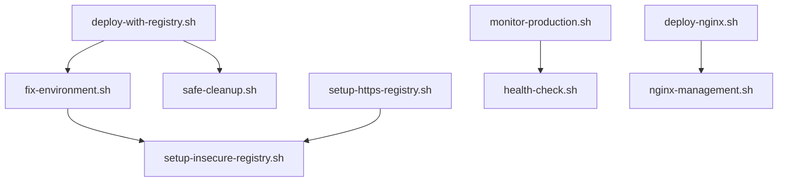

# 📋 Инвентаризация скриптов Aisha Backend

## 🏗️ Структура и назначение скриптов

### 🚀 Основные деплой скрипты

#### Актуальные (рекомендуемые)
- `scripts/production/deploy-with-registry.sh` - **Современный деплой через Docker Registry**
- `scripts/production/fix-environment.sh` - **Исправление проблем окружения**
- `scripts/production/safe-cleanup.sh` - **Безопасная очистка ресурсов**
- `scripts/docker-registry/setup-insecure-registry.sh` - **Настройка HTTP registry**
- `scripts/docker-registry/setup-https-registry.sh` - **Настройка HTTPS registry**

#### Legacy (требуют обновления)
- `scripts/deploy-to-production.sh` - Старый деплой скрипт
- `scripts/production/deploy-production-final.sh` - Устаревший финальный деплой
- `scripts/production/deploy_production_minimal.sh` - Минимальный деплой
- `scripts/deployment/deploy-production.sh` - Дублирующий функционал

### 🔧 Утилиты и мониторинг

#### Диагностика
- `scripts/check-production.sh` - **Проверка состояния продакшн**
- `scripts/utils/health-check.sh` - Проверка здоровья сервисов
- `scripts/utils/debug-transcription.sh` - Отладка транскрибации
- `scripts/monitoring/monitor-production.sh` - Мониторинг продакшн
- `scripts/monitoring/monitor-cluster.sh` - Мониторинг кластера

#### Управление
- `scripts/production/fix-standby-bot.sh` - Управление standby ботом
- `scripts/production/deploy-transcription-fix.sh` - Исправление транскрибации
- `scripts/utils/make-executable.sh` - Установка прав на выполнение

### 🌐 Nginx и инфраструктура

#### Nginx
- `scripts/deploy-nginx.sh` - Деплой Nginx конфигурации
- `scripts/nginx-management.sh` - Управление Nginx
- `scripts/infrastructure/nginx-management.sh` - Дублирующий функционал

#### Инфраструктура
- `scripts/setup-production-server.sh` - Настройка продакшн сервера
- `scripts/infrastructure/production-setup.sh` - Альтернативная настройка
- `scripts/infrastructure/registry-setup.sh` - Настройка реестра

### 🐳 Docker и Registry

#### Registry
- `scripts/setup-registry.sh` - Базовая настройка registry
- `scripts/deploy/setup-registry.sh` - Альтернативная настройка
- `scripts/deploy/fix-registry.sh` - Исправление проблем registry

#### Docker управление
- `scripts/cleanup/cleanup-docker.sh` - Очистка Docker ресурсов
- `scripts/deployment/setup-production-docker.sh` - Настройка Docker на продакшн
- `scripts/deployment/push-images.sh` - Push образов в registry

### 🔄 Webhook и API

- `scripts/deploy-webhook-prod.sh` - Деплой webhook на продакшн
- `scripts/deploy/webhook-complete.sh` - Полный деплой webhook
- `scripts/deploy/setup-autostart.sh` - Настройка автозапуска

### 🏠 Локальная разработка

- `scripts/deploy-local.sh` - Локальный деплой
- `scripts/check-prod-readiness.sh` - Проверка готовности к продакшн

## 📊 Статистика скриптов

### По категориям:
- **Деплой**: 12 скриптов
- **Мониторинг**: 4 скрипта  
- **Инфраструктура**: 6 скриптов
- **Утилиты**: 6 скриптов
- **Docker/Registry**: 8 скриптов

### По статусу:
- **✅ Актуальные**: 8 скриптов
- **⚠️ Требуют обновления**: 15 скриптов
- **🗑️ Legacy**: 12 скриптов

## 🔗 Зависимости между скриптами

## 🧹 Рекомендации по очистке

### Скрипты к удалению (дублируют функционал):
- `scripts/infrastructure/nginx-management.sh` (есть в корне)
- `scripts/deploy/setup-registry.sh` (заменен на docker-registry/)
- `scripts/deployment/deploy-production.sh` (устарел)

### Скрипты к обновлению:
- `scripts/deploy-to-production.sh` - добавить поддержку registry
- `scripts/check-production.sh` - обновить проверки
- `scripts/monitoring/monitor-production.sh` - улучшить метрики

## 🎯 Приоритетные задачи

1. **Консолидация деплой скриптов**
   - Оставить только `deploy-with-registry.sh`
   - Удалить дублирующие скрипты

2. **Стандартизация naming**
   - Привести к единому стилю именования
   - Структурировать по директориям

3. **Документация**
   - Добавить help/usage в каждый скрипт
   - Создать примеры использования

4. **Тестирование**
   - Добавить тесты для критических скриптов
   - Валидация входных параметров

## 📝 Правила для новых скриптов

1. **Расположение**: соответствующая директория в `scripts/`
2. **Именование**: kebab-case, описательное
3. **Структура**: shebang, set -euo pipefail, функции logging
4. **Документация**: комментарии в заголовке скрипта
5. **Права**: 755 (исполняемые)

## 🔄 Последнее обновление

**Дата**: 2025-06-10  
**Версия**: v1.0  
**Автор**: AI Assistant  
**Статус**: ✅ Актуально 