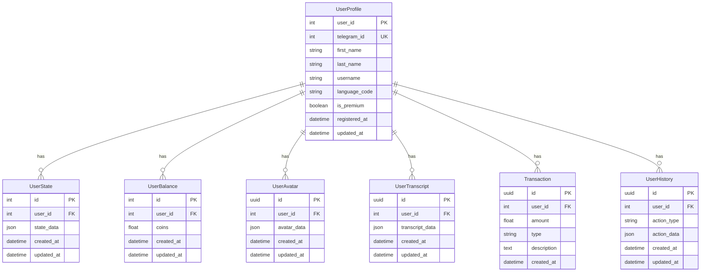

# Архитектура проекта

> **Внимание! Все модели БД определяются только в `database/models.py`. Импорты моделей — только `from database.models import ...`. Дублирующих моделей в других папках быть не должно.**

## Общая структура

Проект построен по принципу чистой архитектуры с разделением на слои:

1. **Presentation Layer** (Telegram Bot)
   - Обработчики команд
   - Клавиатуры
   - Форматирование сообщений
   
   > **Важно:** Хендлеры регистрируются в порядке специфичности:
   > 1. Специфичные хендлеры (например, в transcribe.py) регистрируются первыми
   > 2. Общие хендлеры (например, в general.py) регистрируются последними
   > 3. Избегаем дублирования хендлеров для одних и тех же команд/кнопок

2. **Service Layer** (Бизнес-логика)
   - UserService
   - AvatarService
   - TranscriptService
   - BalanceService
   - HistoryService

3. **Repository Layer** (Доступ к данным)
   - UserRepository
   - UserStateRepository
   - UserBalanceRepository
   - UserAvatarRepository
   - UserTranscriptRepository
   - TransactionRepository
   - UserHistoryRepository

4. **Data Layer**
   - PostgreSQL (основное хранилище)
   - MinIO (файловое хранилище)

## База данных

> **Основная рабочая база данных: `aisha`. Имя и параметры подключения задаются через .env и alembic.ini.**

### Схема данных



### Индексы

1. **UserProfile**
   - `idx_user_telegram_id` (UNIQUE) на `telegram_id`
   - `idx_user_username` на `username`

2. **UserState**
   - `idx_user_state_user_id` на `user_id`

3. **UserBalance**
   - `idx_user_balance_user_id` на `user_id`

4. **UserAvatar**
   - `idx_user_avatar_user_id` на `user_id`
   - `idx_user_avatar_created_at` на `created_at`

5. **UserTranscript**
   - `idx_user_transcript_user_id` на `user_id`
   - `idx_user_transcript_created_at` на `created_at`

6. **Transaction**
   - `idx_transaction_user_id` на `user_id`
   - `idx_transaction_created_at` на `created_at`

7. **UserHistory**
   - `idx_user_history_user_id` на `user_id`
   - `idx_user_history_action_type` на `action_type`
   - `idx_user_history_created_at` на `created_at`

### Ограничения

1. **UserBalance**
   - `check_coins_positive`: coins >= 0

2. **Transaction**
   - `check_transaction_type`: type IN ('credit', 'debit')

3. **UserHistory**
   - `check_action_type`: action_type IN ('avatar_created', 'transcript_created', 'balance_updated', 'transaction_created')

4. **Внешние ключи**
   - Все внешние ключи настроены с `

## Хранение транскриптов
- Все транскрипты (текстовые и аудио) хранятся только в MinIO (bucket transcripts).
- Кэш последних транскриптов пользователя реализован через таблицу user_transcript_cache (user_id, path=minio_key, created_at).
- Локальные файлы не используются для доступа к транскриптам.
- Все сервисы и хендлеры работают только с MinIO-ключами и кэшем.
- Для получения текста транскрипта используется download_file(bucket, minio_key) по ключу из кэша.

## Аватары: хранение и обработка

- Все состояния и метаданные аватаров хранятся в PostgreSQL (user_avatars, user_avatar_photos)
- Все фото аватаров — только в MinIO (bucket avatars/)
- Предпросмотр и галерея работают через выборку из user_avatar_photos и скачивание из MinIO
- Нет локальных json-файлов, нет legacy FSM
- Все сервисы асинхронные, работают через SQLAlchemy AsyncSession

### Схема работы галереи
1. Фото пользователя загружаются через Telegram → сохраняются в MinIO и user_avatar_photos
2. Для предпросмотра галереи фото берутся из user_avatar_photos (по avatar_id, user_id), скачиваются из MinIO по ключу
3. Все переходы, удаление, просмотр фото — только через БД и MinIO

### Пример запроса фото для галереи
```python
photos = await get_avatar_photos_from_db(user_id, avatar_id, session)
# ...
```

## Управление состоянием (FSM)

### Архитектура
1. Все состояния хранятся в PostgreSQL через `StateRepository`
2. Каждая операция с состоянием требует `AsyncSession`
3. Состояния привязаны к UUID пользователя, а не к Telegram ID

### Компоненты
1. `StateRepository` - работа с БД
2. `state_utils.py` - утилиты для работы с состоянием
3. `StateType` - типы состояний (str или Dict[str, Any])

### Правила использования
1. Всегда передавать `session` в функции:
   - `set_state(user_id, state, session)`
   - `get_state(user_id, session)`
   - `clear_state(user_id, session)`
2. Использовать UUID вместо Telegram ID
3. Логировать все изменения состояния
4. Обрабатывать ошибки БД

### Примеры состояний
```python
class States:
    MAIN_MENU = "main_menu"
    AVATAR_CREATE = "avatar_create"
    AVATAR_EDIT = "avatar_edit"
    AVATAR_CONFIRM = "avatar_confirm"
    AVATAR_ENTER_NAME = "avatar_enter_name"
    TRANSCRIBE_TXT = "transcribe_txt"
    TRANSCRIBE_AUDIO = "transcribe_audio"
```

### Миграция состояний
1. Все состояния хранятся в PostgreSQL
2. Используется `StateRepository` для CRUD операций
3. Поддерживается обратная совместимость через алиасы