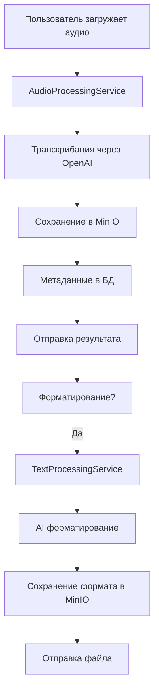

# Архитектура проекта Aisha Bot v2

## 📋 Обзор

Aisha Bot - современный Telegram-бот для транскрибации аудио и обработки текста с использованием AI/ML технологий.

### Основные компоненты:
- **Telegram Bot** (aiogram 3.x)
- **База данных** PostgreSQL с SQLAlchemy (async)
- **Объектное хранилище** MinIO для файлов
- **AI/ML сервисы** OpenAI API
- **Кэширование** Redis (планируется)

## 🏗️ Архитектура модулей

### 1. Структура проекта
```
aisha_v2/
├── app/
│   ├── core/           # Основные компоненты
│   │   ├── database.py # Подключение к БД
│   │   ├── settings.py # Конфигурация
│   │   └── di.py       # Dependency Injection
│   ├── handlers/       # Обработчики Telegram
│   │   ├── main.py     # Главное меню
│   │   ├── transcript_main.py       # История и навигация транскриптов
│   │   └── transcript_processing.py # Обработка аудио/текста
│   ├── services/       # Бизнес-логика
│   │   ├── transcript.py         # Управление транскриптами
│   │   ├── audio_processing/     # Обработка аудио
│   │   ├── text_processing/      # Обработка текста
│   │   └── storage/             # Работа с файлами
│   ├── database/       # Модели и репозитории
│   │   ├── models/     # SQLAlchemy модели
│   │   └── repositories/ # Репозитории данных
│   ├── keyboards/      # Клавиатуры Telegram
│   ├── texts/          # Шаблоны сообщений
│   └── shared/         # Общие утилиты
└── docs/              # Документация
```

### 2. Принципы архитектуры

#### 2.1 Разделение ответственности
- **Handlers** - только маршрутизация и вызовы сервисов
- **Services** - вся бизнес-логика
- **Repositories** - работа с БД
- **Storage** - работа с файлами

#### 2.2 Dependency Injection
Все зависимости внедряются через DI контейнер:
```python
from aisha_v2.app.core.di import get_transcript_service

async with get_session() as session:
    transcript_service = get_transcript_service(session)
    result = await transcript_service.process(...)
```

#### 2.3 Асинхронность везде
- Все I/O операции асинхронные
- Использование async/await
- Контекстные менеджеры для ресурсов

## 🗄️ Архитектура хранения данных

### 1. База данных (PostgreSQL)
Хранятся только метаданные:
```sql
users:               -- Пользователи
  ├── id (UUID)
  ├── telegram_id
  └── metadata

user_transcripts:    -- Метаданные транскриптов
  ├── id (UUID)
  ├── user_id (FK)
  ├── transcript_key  -- Путь в MinIO
  ├── transcript_metadata (JSON)
  └── timestamps
```

### 2. Объектное хранилище (MinIO)
Все файлы хранятся в MinIO:
```
transcripts/
├── {user_id}/
│   ├── {transcript_id}.txt       # Основной текст
│   ├── summary_{transcript_id}.txt    # Краткое содержание
│   ├── todo_{transcript_id}.txt       # Список задач
│   └── protocol_{transcript_id}.txt   # Протокол
```

### 3. Принципы работы с данными
1. **Метаданные в БД** - быстрый поиск и фильтрация
2. **Контент в MinIO** - масштабируемое хранение файлов
3. **Кэширование** - часто запрашиваемые данные

## 🔄 Архитектура обработки

### 1. Жизненный цикл транскрипта



### 2. Обработка ошибок
- Логирование всех исключений
- Fallback сценарии
- Понятные сообщения пользователю
- Восстановление состояния FSM

### 3. FSM состояния
```python
class TranscribeStates(StatesGroup):
    menu = State()              # Главное меню транскрибации
    waiting_audio = State()     # Ожидание аудио
    waiting_text = State()      # Ожидание текста
    processing = State()        # Обработка
    result = State()           # Результат
    format_selection = State() # Выбор формата
    error = State()           # Ошибка
```

## 🎨 Архитектура UX/UI

### 1. Навигация
```
Главное меню
    ↓ transcribe_menu
Меню транскрибации
    ↓ transcribe_history
История транскриптов
    ↓ transcribe_open_{id}
Карточка транскрипта
```

### 2. Принципы интерфейса
- **Inline клавиатуры** для всех действий
- **Эмодзи** для визуального разделения
- **Редактирование сообщений** вместо новых
- **Fallback** на новые сообщения при ошибках

### 3. Дружелюбные названия файлов
```python
# Было: 2025-05-21_10-01_file_362.txt | 2025-05-23 04:32 | Текст
# Стало: 📝 Текст (569 сл.) • 23.05 04:32
```

## 🔧 Технические решения

### 1. Async/Await всюду
```python
# Правильно
async def process_data():
    async with get_session() as session:
        result = await service.process(session)
        return result

# Неправильно
def process_data():
    session = get_session()
    result = service.process(session)
    return result
```

### 2. Безопасная работа с типами
```python
# Union типы для совместимости
user_id: Union[int, str, UUID]

# Безопасная конвертация
transcript_dict = {
    "id": str(id_attr) if id_attr else None,
    "created_at": created_at_attr.isoformat() if created_at_attr else None,
}
```

### 3. Логирование с контекстом
```python
logger.info(f"[AUDIO] Начало обработки для user_id={user_id}")
logger.error(f"[AUDIO] Ошибка: {error}", exc_info=True)
```

## 📊 Мониторинг и метрики

### 1. Логирование
- Структурированные логи с префиксами
- Разные уровни для разных событий
- Полный стек ошибок

### 2. Метрики (планируется)
- Время обработки транскриптов
- Использование ресурсов
- Ошибки и их частота

## 🚀 Развертывание

### 1. Docker контейнеры
- Bot контейнер
- PostgreSQL
- MinIO
- Redis (планируется)

### 2. Конфигурация
Все настройки через переменные окружения:
```env
DATABASE_URL=postgresql+asyncpg://...
MINIO_ENDPOINT=localhost:9000
OPENAI_API_KEY=sk-...
TELEGRAM_BOT_TOKEN=...
```

## 📈 Планы развития

### Краткосрочные
- [ ] Кэширование Redis
- [ ] Метрики и мониторинг
- [ ] Unit тесты

### Долгосрочные
- [ ] Горизонтальное масштабирование
- [ ] AI модели локально
- [ ] API для интеграций

## 🔒 Безопасность

### 1. Данные
- Секреты в переменных окружения
- Не логируем чувствительные данные
- Валидация входных данных

### 2. Доступ
- Проверка прав пользователей
- Изоляция данных пользователей
- Безопасные соединения

---

**См. также:**
- `docs/best_practices.md` - лучшие практики разработки
- `docs/navigation_transcript.md` - архитектура навигации
- `FIXES_SUMMARY_FINAL.md` - история исправлений 