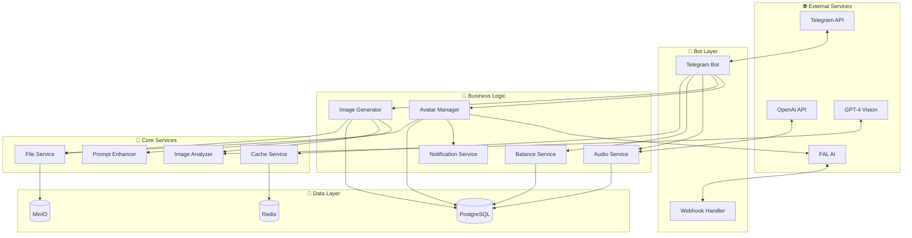
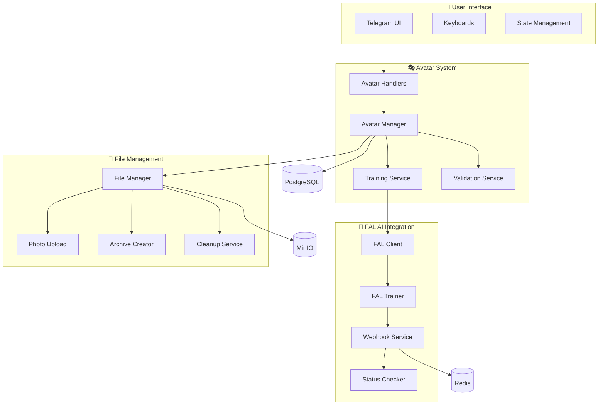
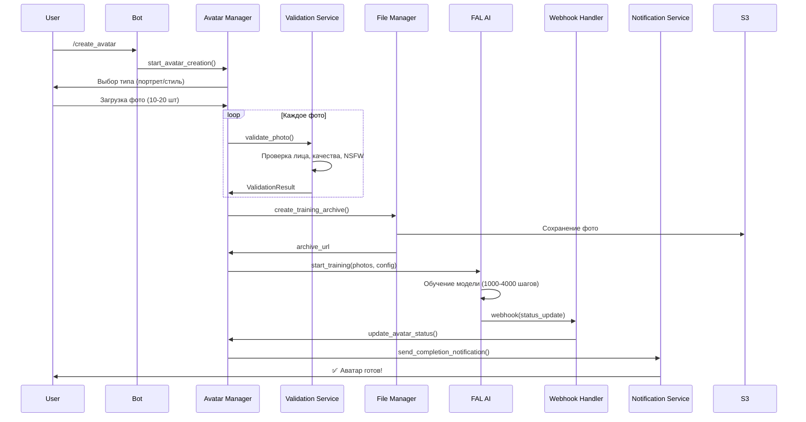
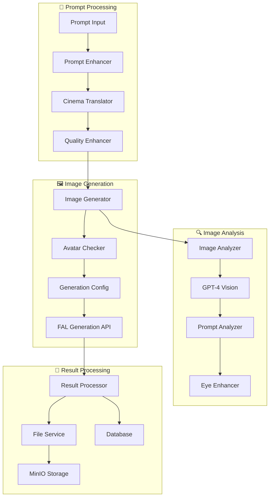
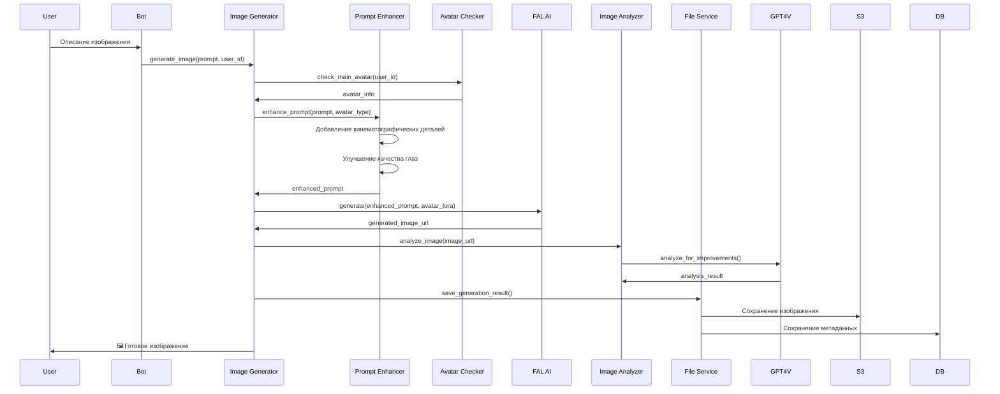
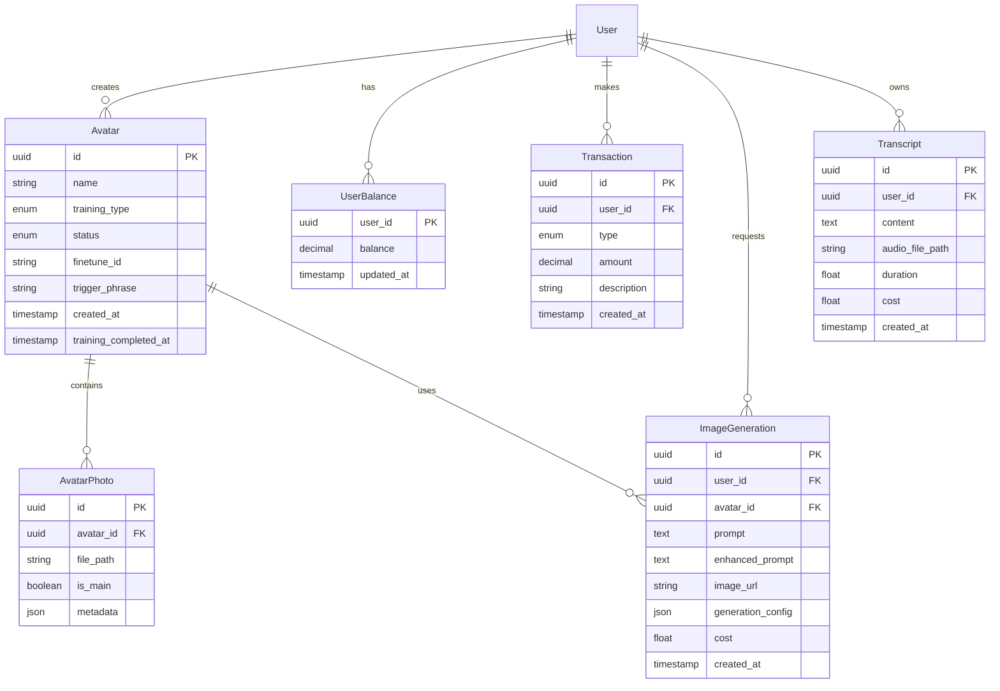

# 🏗️ Архитектура Aisha Bot v2

## 📋 Общий обзор

Aisha Bot v2 - это современный AI-powered Telegram-бот с системой персональных аватаров, генерацией изображений и транскрибацией аудио. Проект построен на микросервисной архитектуре с использованием современных технологий.

## 🎯 Основная функциональность

### ✅ Реализовано

#### 🎭 Система AI-аватаров
- **Создание персональных моделей** через FAL AI
- **Два типа обучения**: портретные и художественные аватары
- **Автоматический пайплайн**: загрузка фото → обучение → готовая модель
- **Управление аватарами**: галерея, статусы, метаданные

#### 🖼️ Генерация изображений
- **Создание фото с аватаром** по текстовому описанию
- **Кинематографический промпт-инжиниринг** для улучшения качества
- **Анализ изображений** через GPT-4 Vision API
- **Специальные улучшения** для качества глаз и лица

#### 🔊 Транскрибация аудио
- **OpenAI Whisper API** для преобразования речи в текст
- **Smart chunking** для длинных аудиофайлов
- **Сохранение результатов** в персональной галерее

#### 💰 Система балансов
- **Кредитная система** для оплаты AI-услуг
- **Гибкая тарификация** для разных типов операций
- **История транзакций** и управление балансом

## 🏗️ Архитектура системы



## 🎭 Система аватаров

### Архитектура компонентов



### Процесс создания аватара



## 🖼️ Система генерации изображений

### Архитектура генерации



### Процесс генерации изображения



## 💾 Модель данных

### Основные сущности



## 🔧 Технический стек

### Backend Framework
- **Python 3.12** - Основной язык программирования
- **aiogram 3.4.1** - Telegram Bot API framework
- **FastAPI** - REST API для webhook и внешних интеграций
- **SQLAlchemy 2.0** - ORM с поддержкой async/await
- **Alembic** - Система миграций базы данных

### AI & ML Services
- **FAL AI** - Обучение персональных моделей и генерация изображений
- **OpenAI GPT-4 Vision** - Анализ изображений и улучшение промптов
- **OpenAI Whisper** - Транскрибация аудио в текст

### Data Storage
- **PostgreSQL 15+** - Основная реляционная база данных
- **Redis 7+** - Кеширование, сессии, очереди задач
- **MinIO** - S3-совместимое объектное хранилище

### Infrastructure
- **Docker & Docker Compose** - Контейнеризация и оркестрация
- **Nginx** - Reverse proxy и SSL termination
- **ffmpeg** - Обработка аудио и видео файлов

## 🌐 Сетевая архитектура

### Development Environment
```
┌─────────────────┐    ┌─────────────────┐    ┌─────────────────┐
│   Local Dev     │    │   PostgreSQL    │    │     Redis       │
│  (localhost)    │    │ (192.168.0.4)   │    │ (192.168.0.3)   │
│                 │    │                 │    │                 │
│ • Bot (polling) │◄──►│ • Port: 5432    │    │ • Port: 6379    │
│ • Scripts       │    │ • DB: aisha     │    │ • Cache & Queue │
└─────────────────┘    └─────────────────┘    └─────────────────┘
                                ▲                       ▲
                                │                       │
                       ┌─────────────────┐             │
                       │     MinIO       │             │
                       │ (192.168.0.4)   │             │
                       │                 │             │
                       │ • Port: 9000    │◄────────────┘
                       │ • S3 API        │
                       │ • File Storage  │
                       └─────────────────┘
```

### Production Environment
```
┌─────────────────┐    ┌─────────────────┐    ┌─────────────────┐
│   Production    │    │   PostgreSQL    │    │     Redis       │
│ (192.168.0.10)  │    │ (192.168.0.4)   │    │ (192.168.0.3)   │
│                 │    │                 │    │                 │
│ • Bot (webhook) │◄──►│ • Port: 5432    │    │ • Port: 6379    │
│ • API Server    │    │ • DB: aisha     │    │ • Cache & Queue │
│ • Nginx         │    │                 │    │                 │
└─────────────────┘    └─────────────────┘    └─────────────────┘
         ▲                       ▲                       ▲
         │                       │                       │
         │              ┌─────────────────┐             │
         │              │     MinIO       │             │
         │              │ (192.168.0.4)   │             │
         │              │                 │             │
         └──────────────►│ • Port: 9000    │◄────────────┘
                        │ • S3 API        │
                        │ • File Storage  │
                        └─────────────────┘
```

## 🔄 Основные процессы

### Жизненный цикл аватара

1. **Создание** - Пользователь выбирает тип и загружает фото
2. **Валидация** - Проверка качества, наличия лиц, NSFW
3. **Подготовка** - Создание архива для обучения
4. **Обучение** - FAL AI обучает персональную модель (1000-4000 шагов)
5. **Завершение** - Получение LoRA модели и уведомление пользователя
6. **Использование** - Генерация изображений с обученным аватаром

### Процесс генерации изображения

1. **Ввод промпта** - Пользователь описывает желаемое изображение
2. **Проверка аватара** - Система находит основной аватар пользователя
3. **Улучшение промпта** - Добавление кинематографических деталей
4. **Генерация** - FAL AI создает изображение с аватаром
5. **Анализ результата** - GPT-4 Vision анализирует качество
6. **Сохранение** - Результат сохраняется в MinIO и БД

## 📊 Мониторинг и метрики

### Health Checks
- **Telegram API** - Проверка подключения к боту
- **PostgreSQL** - Тест подключения к БД
- **Redis** - Проверка кеша и очередей
- **MinIO** - Доступность файлового хранилища
- **FAL AI** - Валидность API ключа
- **OpenAI** - Проверка доступности API

### Ключевые метрики
- **Аватары**: создано, в обучении, завершено
- **Генерации**: количество, успешность, время выполнения
- **Транскрибации**: объем, точность, стоимость
- **Балансы**: пополнения, траты, остатки

## 🔒 Безопасность

### Аутентификация и авторизация
- **Telegram ID** как основной идентификатор
- **Автоматическая регистрация** при первом обращении
- **Проверка прав доступа** к аватарам и контенту

### Защита данных
- **Шифрование** всех API ключей в переменных окружения
- **Валидация входных данных** на всех уровнях
- **NSFW фильтрация** загружаемых изображений
- **Автоматическая очистка** временных файлов

### Rate Limiting
- **Redis-based** ограничения на количество запросов
- **Балансовая система** как естественное ограничение
- **Webhook защита** с проверкой подписи

## 🚀 Масштабирование

### Горизонтальное масштабирование
- **Stateless bot instances** - возможность запуска нескольких экземпляров
- **Redis для состояния** - общее хранилище сессий
- **MinIO clustering** - распределенное файловое хранилище

### Вертикальное масштабирование
- **Асинхронная архитектура** - эффективное использование ресурсов
- **Connection pooling** - оптимизация подключений к БД
- **Кеширование** - снижение нагрузки на основные сервисы

### Планы оптимизации
- **Background workers** - вынос тяжелых операций в отдельные процессы
- **CDN интеграция** - ускорение доставки изображений
- **Database sharding** - разделение данных по пользователям

---

**Документ актуализирован:** Июнь 2025 | **Версия:** 2.0