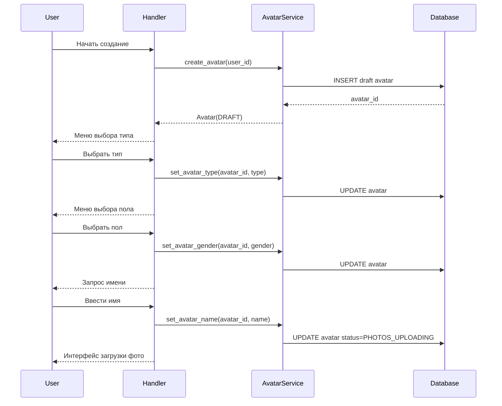
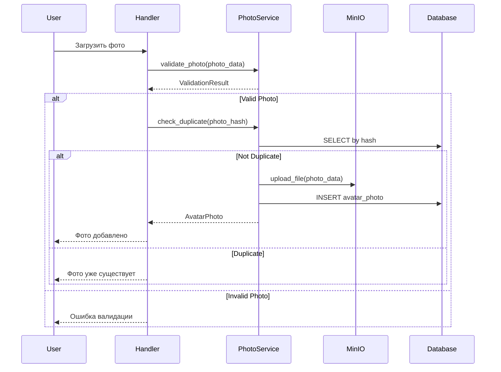
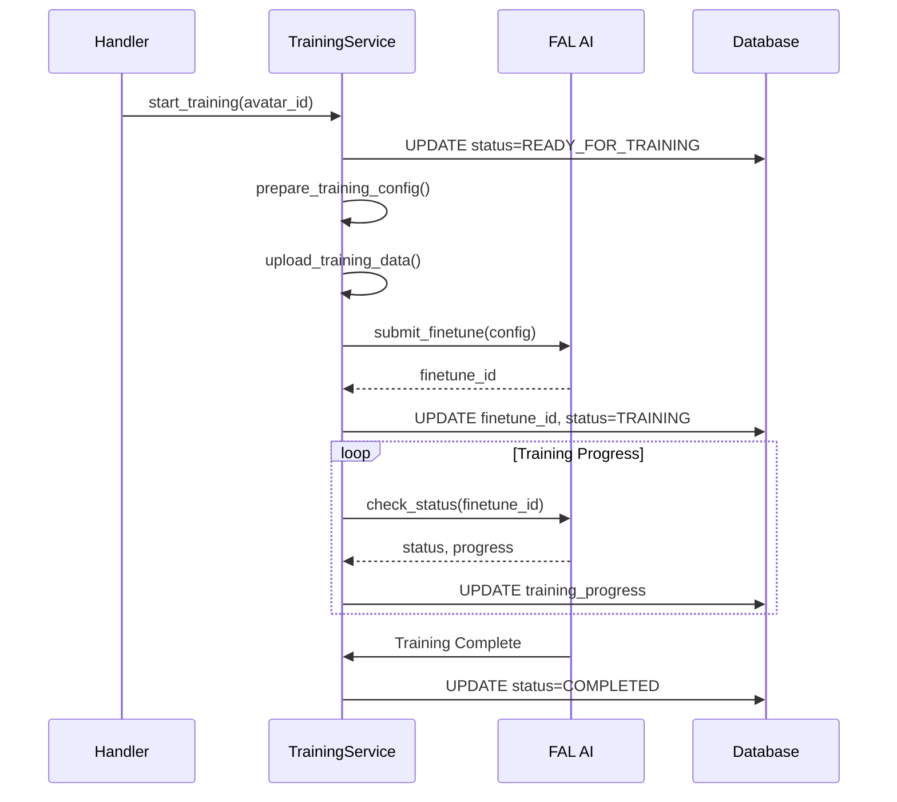

# Архитектура системы аватаров

## 📋 Обзор

Система аватаров предоставляет пользователям возможность создавать, обучать и использовать персонализированные AI-модели для генерации изображений. Архитектура построена на основе лучших практик из архивной версии проекта с адаптацией под современные требования и интеграцию с FAL AI.

## 🏗️ Архитектурные принципы

### Separation of Concerns
- **Модели данных**: Четкое разделение между `Avatar` и `AvatarPhoto`
- **Сервисы**: Разделение по ответственности (DB, файлы, обучение)
- **Обработчики**: Модульная структура для разных этапов workflow
- **Хранилище**: Разделение метаданных (PostgreSQL) и файлов (MinIO)

### Асинхронность и производительность
- Все операции с БД и файловой системой асинхронные
- Буферизация для групповой обработки фото
- Фоновые задачи для тяжелых операций
- Ленивая загрузка и пагинация

### Безопасность и валидация
- Многоуровневая валидация фото
- Дедупликация по хешам
- Ограничения на размер и количество файлов
- Санитизация входных данных

## 📊 Структура данных

### Модель Avatar
```python
class Avatar(Base):
    __tablename__ = "avatars"
    
    # Идентификация
    id: UUID
    user_id: UUID (FK to users)
    
    # Основная информация
    name: str                          # Имя аватара
    gender: AvatarGender              # MALE/FEMALE/OTHER
    avatar_type: AvatarType           # CHARACTER/STYLE/CUSTOM
    status: AvatarStatus              # Жизненный цикл
    
    # FAL AI интеграция
    finetune_id: Optional[str]        # ID модели в FAL AI
    training_progress: int            # 0-100%
    training_started_at: Optional[datetime]
    training_completed_at: Optional[datetime]
    
    # Настройки обучения
    fal_mode: str                     # character/style/custom
    fal_iterations: int               # Количество итераций
    fal_priority: str                 # quality/speed/balanced
    trigger_word: str                 # Триггер-слово для генерации
    lora_rank: int                    # Ранг LoRA адаптера
    
    # Метаданные
    avatar_data: Dict                 # Дополнительные данные
    training_config: Dict             # Конфигурация обучения
    
    # Статистика
    photos_count: int                 # Количество фото
    generations_count: int            # Количество генераций
    
    # Связи
    photos: List[AvatarPhoto]
```

### Модель AvatarPhoto
```python
class AvatarPhoto(Base):
    __tablename__ = "avatar_photos"
    
    # Идентификация
    id: UUID
    avatar_id: UUID (FK to avatars)
    user_id: UUID (FK to users)
    
    # Хранение
    minio_key: str                    # Путь в MinIO
    file_hash: str                    # SHA256 для дедупликации
    
    # Порядок и статус
    upload_order: int                 # Порядок загрузки
    validation_status: PhotoValidationStatus
    
    # Метаданные файла
    file_size: int
    width: Optional[int]
    height: Optional[int]
    format: str                       # jpg/png/webp
    
    # Валидация и качество
    has_face: Optional[bool]          # Детекция лица
    quality_score: Optional[float]    # Оценка качества 0-1
    validation_error: Optional[str]   # Ошибка валидации
    
    # Дополнительные метаданные
    photo_metadata: Dict
```

### Жизненный цикл аватара
```
DRAFT → PHOTOS_UPLOADING → READY_FOR_TRAINING → TRAINING → COMPLETED
  ↓              ↓                    ↓             ↓
ERROR ←──────────┴────────────────────┴─────────────┘
  ↓
CANCELLED
```

## 🏛️ Структура модулей

### Сервисы (app/services/avatar/)

#### AvatarService (avatar_service.py)
**Ответственность**: Основная бизнес-логика управления аватарами
```python
class AvatarService:
    # Создание и управление жизненным циклом
    async def create_avatar(user_id: int) -> Avatar
    async def get_avatar(avatar_id: UUID) -> Optional[Avatar]
    async def update_avatar(avatar_id: UUID, data: Dict) -> Avatar
    async def delete_avatar(avatar_id: UUID) -> bool
    
    # Workflow управление
    async def start_avatar_creation(user_id: int) -> Avatar
    async def finalize_avatar_creation(avatar_id: UUID) -> bool
    async def cancel_avatar_creation(avatar_id: UUID) -> bool
    
    # Статистика и списки
    async def get_user_avatars(user_id: int) -> List[Avatar]
    async def get_avatar_statistics(avatar_id: UUID) -> Dict
```

#### PhotoService (photo_service.py)
**Ответственность**: Управление фотографиями аватаров
```python
class PhotoService:
    # Загрузка и валидация
    async def upload_photo(avatar_id: UUID, photo_data: bytes) -> AvatarPhoto
    async def validate_photo(photo_data: bytes) -> ValidationResult
    async def check_duplicate(photo_hash: str, avatar_id: UUID) -> bool
    
    # Управление фото
    async def get_avatar_photos(avatar_id: UUID) -> List[AvatarPhoto]
    async def delete_photo(photo_id: UUID) -> bool
    async def reorder_photos(avatar_id: UUID, photo_orders: List[int]) -> bool
    
    # Обработка
    async def process_photo_batch(avatar_id: UUID, photos: List[bytes]) -> List[AvatarPhoto]
    async def generate_thumbnails(photo_id: UUID) -> bool
```

#### TrainingService (training_service.py)
**Ответственность**: Интеграция с FAL AI для обучения
```python
class TrainingService:
    # Обучение
    async def start_training(avatar_id: UUID) -> str  # finetune_id
    async def check_training_status(finetune_id: str) -> TrainingStatus
    async def cancel_training(finetune_id: str) -> bool
    
    # Конфигурация
    async def prepare_training_config(avatar_id: UUID) -> Dict
    async def upload_training_data(avatar_id: UUID) -> str  # data_url
    
    # Мониторинг
    async def update_training_progress(avatar_id: UUID) -> None
    async def handle_training_completion(avatar_id: UUID) -> None
    async def handle_training_error(avatar_id: UUID, error: str) -> None
```

### Обработчики (app/handlers/avatar.py)

#### Workflow обработчиков
```python
# Создание аватара
@router.callback_query(F.data == "create_avatar")
async def start_avatar_creation(callback: CallbackQuery)

@router.callback_query(F.data.startswith("avatar_type_"))
async def select_avatar_type(callback: CallbackQuery)

@router.callback_query(F.data.startswith("avatar_gender_"))
async def select_avatar_gender(callback: CallbackQuery)

@router.message(F.text, StateFilter(AvatarStates.waiting_name))
async def process_avatar_name(message: Message)

# Загрузка фото
@router.message(F.photo, StateFilter(AvatarStates.uploading_photos))
async def handle_photo_upload(message: Message)

@router.callback_query(F.data.startswith("photo_action_"))
async def handle_photo_action(callback: CallbackQuery)

# Галерея и навигация
@router.callback_query(F.data.startswith("gallery_"))
async def handle_gallery_navigation(callback: CallbackQuery)

@router.callback_query(F.data.startswith("avatar_card_"))
async def handle_avatar_card_action(callback: CallbackQuery)

# Обучение
@router.callback_query(F.data.startswith("training_"))
async def handle_training_action(callback: CallbackQuery)
```

### Состояния FSM
```python
class AvatarStates(StatesGroup):
    # Создание
    selecting_type = State()      # Выбор типа аватара
    selecting_gender = State()    # Выбор пола
    waiting_name = State()        # Ввод имени
    
    # Загрузка фото
    uploading_photos = State()    # Загрузка фотографий
    confirming_photos = State()   # Подтверждение фото
    
    # Обучение
    configuring_training = State() # Настройка обучения
    training_in_progress = State() # Процесс обучения
    
    # Просмотр
    viewing_gallery = State()     # Просмотр галереи
    viewing_avatar = State()      # Просмотр аватара
```

## 🗄️ Хранилище данных

### PostgreSQL (Метаданные)
- Основная информация об аватарах
- Настройки и конфигурация
- Связи между сущностями
- Статистика и аналитика

### MinIO (Файлы)
```
avatars/
├── user_{user_id}/
│   ├── avatar_{avatar_id}/
│   │   ├── photos/
│   │   │   ├── original/
│   │   │   │   ├── photo_001.jpg
│   │   │   │   ├── photo_002.jpg
│   │   │   │   └── ...
│   │   │   ├── thumbnails/
│   │   │   │   ├── thumb_001.jpg
│   │   │   │   └── ...
│   │   │   └── processed/
│   │   │       ├── crop_001.jpg
│   │   │       └── ...
│   │   ├── training_data/
│   │   │   └── training_set.zip
│   │   └── generated/
│   │       ├── gen_001.jpg
│   │       └── ...
```

## 🔄 Workflow процессы

### 1. Создание аватара


### 2. Загрузка и валидация фото


### 3. Обучение модели


## 🛡️ Безопасность и ограничения

### Валидация фото
```python
class PhotoValidator:
    MAX_FILE_SIZE = 10 * 1024 * 1024  # 10MB
    ALLOWED_FORMATS = ['JPEG', 'PNG', 'WEBP']
    MIN_RESOLUTION = 512
    MAX_RESOLUTION = 4096
    MAX_PHOTOS_PER_AVATAR = 50
    MIN_PHOTOS_FOR_TRAINING = 5
    
    async def validate_photo(self, photo_data: bytes) -> ValidationResult:
        # Размер файла
        if len(photo_data) > self.MAX_FILE_SIZE:
            return ValidationResult(False, "Файл слишком большой")
        
        # Формат и разрешение
        img = Image.open(io.BytesIO(photo_data))
        if img.format not in self.ALLOWED_FORMATS:
            return ValidationResult(False, "Неподдерживаемый формат")
        
        width, height = img.size
        if min(width, height) < self.MIN_RESOLUTION:
            return ValidationResult(False, "Разрешение слишком низкое")
        
        if max(width, height) > self.MAX_RESOLUTION:
            return ValidationResult(False, "Разрешение слишком высокое")
        
        # Детекция лица (опционально)
        has_face = await self.detect_face(photo_data)
        if not has_face:
            return ValidationResult(False, "Лицо не обнаружено")
        
        return ValidationResult(True, "OK")
```

### Дедупликация
```python
async def check_duplicate(self, photo_data: bytes, avatar_id: UUID) -> bool:
    # Вычисляем хеш
    file_hash = hashlib.sha256(photo_data).hexdigest()
    
    # Проверяем в текущем аватаре
    existing = await self.photo_repo.get_by_hash_and_avatar(file_hash, avatar_id)
    if existing:
        return True
    
    # Проверяем у пользователя (опционально)
    user_photos = await self.photo_repo.get_user_photos_by_hash(file_hash, user_id)
    if user_photos:
        logger.warning(f"Дубликат фото у пользователя: {file_hash}")
    
    return False
```

## 📊 Мониторинг и аналитика

### Метрики
- Количество созданных аватаров
- Время обучения моделей
- Успешность обучения
- Количество генераций
- Использование хранилища

### Логирование
```python
# События жизненного цикла
logger.info(f"Avatar created: user_id={user_id}, avatar_id={avatar_id}")
logger.info(f"Training started: avatar_id={avatar_id}, finetune_id={finetune_id}")
logger.info(f"Training completed: avatar_id={avatar_id}, duration={duration}")

# Ошибки
logger.error(f"Photo validation failed: {error_msg}")
logger.error(f"Training failed: avatar_id={avatar_id}, error={error}")

# Производительность
logger.debug(f"Photo upload time: {upload_time}ms")
logger.debug(f"Training progress: {progress}%")
```

## 🔧 Конфигурация

### Настройки аватаров
```python
class AvatarSettings:
    # Ограничения фото
    MAX_PHOTO_SIZE = 10 * 1024 * 1024
    MAX_PHOTOS_PER_AVATAR = 50
    MIN_PHOTOS_FOR_TRAINING = 5
    
    # Форматы
    ALLOWED_PHOTO_FORMATS = ['JPEG', 'PNG', 'WEBP']
    MIN_PHOTO_RESOLUTION = 512
    MAX_PHOTO_RESOLUTION = 4096
    
    # Обучение
    DEFAULT_ITERATIONS = 500
    DEFAULT_PRIORITY = "quality"
    DEFAULT_LORA_RANK = 32
    
    # Хранилище
    AVATAR_BUCKET = "avatars"
    TRAINING_DATA_TTL = 7 * 24 * 3600  # 7 дней
    
    # FAL AI
    FAL_API_TIMEOUT = 300  # 5 минут
    TRAINING_CHECK_INTERVAL = 30  # 30 секунд
```

## 🚀 Планы развития

### Фаза 1: Основная функциональность ✅
- [x] Модели данных
- [x] Базовые сервисы
- [x] Обработчики создания
- [x] Валидация фото

### Фаза 2: Расширенные возможности
- [ ] Batch обработка фото
- [ ] Автоматическая обрезка лиц
- [ ] Улучшенная валидация качества
- [ ] Предпросмотр результатов

### Фаза 3: Интеллектуальные функции
- [ ] Автоматическая категоризация
- [ ] Рекомендации по улучшению
- [ ] A/B тестирование настроек
- [ ] Персонализированные промпты

### Фаза 4: Масштабирование
- [ ] Распределенная обработка
- [ ] Кеширование результатов
- [ ] CDN для изображений
- [ ] Аналитика использования 