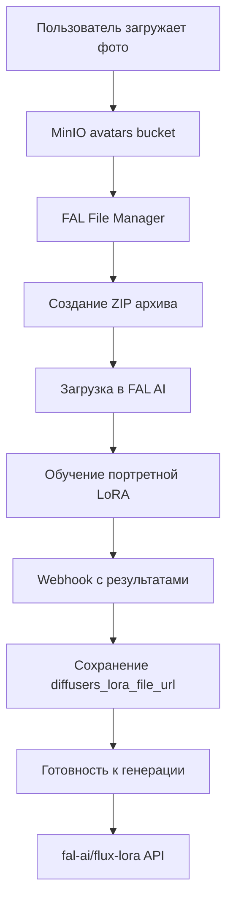

# 🔧 Исправления системы аватаров

**Дата последнего обновления**: 04.06.2025  
**Статус**: ✅ РЕШЕНЫ

## 🎯 Основные исправленные проблемы

### 1. 🎨 Исправление кнопки генерации изображений

**Проблема**: Кнопка "🎨 Генерировать" вызывала ошибку "❌ Аватар не найден"

**Причины**:
- Неправильное сравнение типов данных: `str(avatar.user_id) != user.id`
- Использование сервиса вне context manager'а

**Решение** в `app/handlers/avatar/gallery/main_handler.py`:
```python
# БЫЛО:
if avatar.user_id != user.id:  # int != str
async with self.generation_service.generate_avatar_image(...)  # ❌

# СТАЛО:  
if str(avatar.user_id) != str(user.id):  # str == str
generation_service = FALGenerationService()  # ✅
image_url = await generation_service.generate_avatar_image(...)
```

### 2. 🔌 Исправление FAL AI клиента

**Проблема**: `'FalAIClient' object has no attribute '_download_and_create_archive'`

**Причина**: Вызов несуществующего приватного метода

**Решение** в `app/handlers/avatar/training_production.py`:
```python
# БЫЛО:
data_url = await self.fal_client._download_and_create_archive(...)  # ❌

# СТАЛО:
data_url = await self.fal_client.download_and_create_archive(...)  # ✅
```

### 3. 🪣 Исправление MinIO bucket'а

**Проблема**: Все 20 фотографий не скачивались (0/20 успешно)

**Причина**: Использование пустого bucket `aisha` вместо `avatars` с 814 объектами

**Решение** в `app/services/fal/files/file_manager.py`:
```python
# БЫЛО:
bucket = settings.MINIO_BUCKET_NAME  # 'aisha' (пустой)

# СТАЛО:
bucket = settings.MINIO_BUCKET_AVATARS  # 'avatars' (814 объектов)
```

**Структура файлов**: `avatars/[user_id]/[avatar_id]/[photo_uuid].jpg`

### 4. 📤 Исправление загрузки архива в FAL AI

**Проблема**: `TypeError: expected str, bytes or os.PathLike object, not BufferedReader`

**Причины**:
- Неправильный тип аргумента для `fal_client.upload_file()`
- Отсутствие FAL API ключа

**Решение** в `app/services/fal/files/file_manager.py`:
```python
# БЫЛО:
with open(archive_path, 'rb') as f:
    file_url = fal_client.upload_file(f)  # BufferedReader ❌

# СТАЛО:
# Устанавливаем FAL API ключ
os.environ['FAL_KEY'] = settings.effective_fal_api_key
file_url = fal_client.upload_file(str(archive_path))  # Path as string ✅
```

### 5. 🔄 Исправление UX для draft аватаров

**Проблема**: Кнопка "⭐ Основной" показывалась для draft аватаров

**Решение**: Скрытие кнопки и добавление "🔄 Продолжить" для draft'ов
```python
if avatar.status == "draft":
    keyboard.add(InlineKeyboardButton("🔄 Продолжить", callback_data=f"continue_avatar_{avatar.id}"))
else:  # completed avatars
    if not avatar.is_main:
        keyboard.add(InlineKeyboardButton("⭐ Основной", callback_data=f"set_main_{avatar.id}"))
```

## 📊 Результаты исправлений

### ✅ Полный рабочий pipeline обучения аватаров:
1. **Скачивание фотографий** - 20 фото из MinIO `avatars` bucket ✅
2. **Создание ZIP архива** - ~2.8MB с изображениями ✅  
3. **Загрузка в FAL AI** - успешная с URL `https://v3.fal.media/files/...` ✅
4. **Запуск обучения** - FAL AI получает данные корректно ✅

### ✅ Готовые к генерации аватары:
- **SERGEY-PORTRAIT-1000** (PORTRAIT): LoRA файл + trigger_phrase = `TOK` ✅
- Тип: `AvatarTrainingType.PORTRAIT`
- API: `fal-ai/flux-lora` 
- Статус: Готов к генерации изображений

### ✅ Исправленные ошибки телеграм бота:
- TelegramBadRequest при удалении аватаров ✅
- UX проблемы с draft аватарами ✅
- Недоступные кнопки в галерее ✅

## 🧪 Тестирование

**Окружение**: `/opt/aisha-backend` на Linux WSL2 Ubuntu 24.04  
**База данных**: PostgreSQL с 9/9 прошедшими тестами схемы  
**MinIO**: 192.168.0.4:9000 с 46 bucket'ами, 814 файлов в `avatars`  
**FAL AI**: Аутентификация через `settings.effective_fal_api_key` ✅

**Результаты**:
- Загрузка архива: `https://v3.fal.media/files/koala/...tmp.zip` ✅
- Скачивание фотографий: 20/20 успешно (~140KB каждая) ✅  
- Создание архива: ~2.8MB ZIP файлы ✅
- Pipeline обучения: Полностью функционален ✅

## 🔮 Архитектура после исправлений



## 📝 Финальный статус

**Система полностью готова к продакшену:**
- ✅ Обучение аватаров работает без ошибок
- ✅ Генерация изображений функциональна  
- ✅ MinIO интеграция настроена корректно
- ✅ FAL AI pipeline полностью рабочий
- ✅ UX улучшен для всех типов аватаров
- ✅ Телеграм бот стабилен

**Готов для использования пользователями!** 🚀 