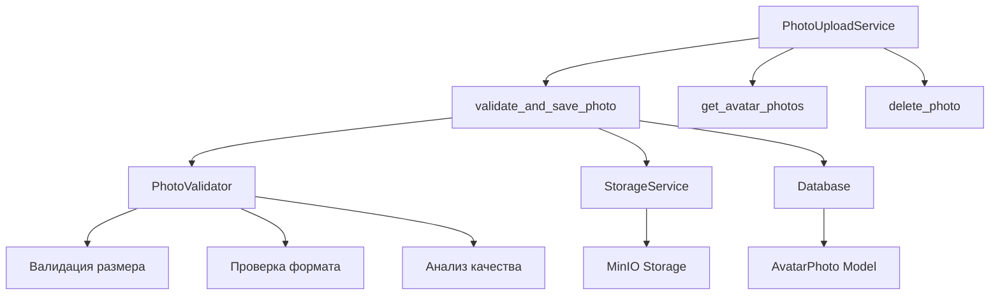

# Avatar Photo Service - Документация

**Файл:** `app/services/avatar/photo_service.py`  
**Класс:** `PhotoUploadService`  
**Назначение:** Управление загрузкой и валидацией фотографий для обучения аватаров

## Описание

`PhotoUploadService` обеспечивает полный цикл работы с фотографиями аватаров: валидацию, обработку, сохранение в MinIO и управление метаданными в базе данных. Сервис интегрирован с валидатором фотографий и обеспечивает высокое качество данных для обучения.

## Архитектура



## Основные методы

### `__init__(self)`
Инициализирует сервис с зависимостями.

**Зависимости:**
- `StorageService`: Для работы с MinIO
- `PhotoValidator`: Для валидации фотографий
- `AvatarPhotoRepository`: Для работы с БД

### `async def validate_and_save_photo(avatar_id, photo_data, filename)`
Основной метод для валидации и сохранения фотографии.

**Параметры:**
- `avatar_id` (UUID): Идентификатор аватара
- `photo_data` (bytes): Данные фотографии
- `filename` (str): Имя файла

**Возвращает:**
- `Tuple[bool, str, Optional[AvatarPhoto]]`: (успех, сообщение, модель_фото)

**Процесс обработки:**
1. Валидация фотографии через PhotoValidator
2. Генерация уникального имени файла
3. Сохранение в MinIO
4. Создание записи в базе данных
5. Возврат результата

**Пример:**
```python
service = PhotoUploadService()
success, message, photo = await service.validate_and_save_photo(
    avatar_id=avatar_id,
    photo_data=photo_bytes,
    filename="selfie.jpg"
)

if success:
    print(f"Фото сохранено: {photo.file_path}")
else:
    print(f"Ошибка: {message}")
```

### `async def get_avatar_photos(avatar_id, user_id)`
Получает все фотографии аватара с проверкой прав доступа.

**Параметры:**
- `avatar_id` (UUID): Идентификатор аватара
- `user_id` (UUID): Идентификатор пользователя

**Возвращает:**
- `List[AvatarPhoto]`: Список фотографий аватара

**Безопасность:**
- Проверяет принадлежность аватара пользователю
- Возвращает только активные фотографии

### `async def delete_photo(photo_id, user_id)`
Удаляет фотографию с проверкой прав доступа.

**Параметры:**
- `photo_id` (UUID): Идентификатор фотографии
- `user_id` (UUID): Идентификатор пользователя

**Возвращает:**
- `Tuple[bool, str]`: (успех, сообщение)

**Процесс удаления:**
1. Проверка существования и прав доступа
2. Удаление файла из MinIO
3. Мягкое удаление из базы данных (is_deleted=True)

## Валидация фотографий

### Интеграция с PhotoValidator
```python
# Валидация через улучшенный валидатор
validation_result = await self.photo_validator.validate_photo_comprehensive(
    photo_data=photo_data,
    filename=filename,
    avatar_id=avatar_id
)

if not validation_result.is_valid:
    return False, validation_result.error_message, None
```

### Проверки валидации
- **Размер файла**: До 20MB
- **Формат**: JPEG, PNG, WebP
- **Разрешение**: Минимум 256x256, максимум 4096x4096
- **Качество изображения**: Анализ резкости и освещения
- **Дубликаты**: Проверка по MD5 хешу
- **Лимиты**: Максимум фотографий на аватар

## Управление файлами

### Генерация путей
```python
def _generate_file_path(self, avatar_id: UUID, original_filename: str) -> str:
    """Генерирует уникальный путь для файла"""
    timestamp = int(time.time())
    file_extension = Path(original_filename).suffix.lower()
    unique_filename = f"photo_{timestamp}_{uuid.uuid4().hex[:8]}{file_extension}"
    return f"avatars/{avatar_id}/{unique_filename}"
```

### Сохранение в MinIO
```python
# Сохранение с правильным content-type
content_type = self._get_content_type(filename)
file_url = await self.storage.upload_file(
    bucket_name="avatars",
    object_name=file_path,
    data=photo_data,
    content_type=content_type
)
```

## Модель данных

### AvatarPhoto
```python
class AvatarPhoto(Base):
    id: UUID
    avatar_id: UUID
    file_path: str          # Путь в MinIO
    file_url: str           # Полный URL
    original_filename: str  # Исходное имя файла
    file_size: int          # Размер в байтах
    content_type: str       # MIME тип
    md5_hash: str           # Хеш для дубликатов
    upload_order: int       # Порядок загрузки
    is_deleted: bool        # Мягкое удаление
    created_at: datetime
    updated_at: datetime
```

## Обработка ошибок

### Типы ошибок
```python
# Ошибки валидации
"Файл слишком большой (максимум 20MB)"
"Неподдерживаемый формат файла"
"Изображение слишком маленькое (минимум 256x256)"
"Дубликат фотографии уже существует"

# Ошибки хранилища
"Ошибка сохранения в хранилище"
"Ошибка удаления файла"

# Ошибки доступа
"Аватар не найден или не принадлежит пользователю"
"Фотография не найдена"
```

### Обработка исключений
```python
try:
    success, message, photo = await service.validate_and_save_photo(...)
    if not success:
        logger.warning(f"Валидация не пройдена: {message}")
        return error_response(message)
except Exception as e:
    logger.exception(f"Критическая ошибка загрузки фото: {e}")
    return error_response("Внутренняя ошибка сервера")
```

## Примеры использования

### Загрузка фотографии в хендлере
```python
@router.message(F.photo, AvatarStates.uploading_photos)
async def handle_photo_upload(message: Message, state: FSMContext):
    # Получение данных состояния
    data = await state.get_data()
    avatar_id = UUID(data["avatar_id"])
    
    # Скачивание фото от Telegram
    photo = message.photo[-1]  # Наибольшее разрешение
    photo_data = await bot.download(photo.file_id)
    
    # Валидация и сохранение
    service = PhotoUploadService()
    success, message_text, photo_model = await service.validate_and_save_photo(
        avatar_id=avatar_id,
        photo_data=photo_data.read(),
        filename=f"telegram_photo_{photo.file_id}.jpg"
    )
    
    if success:
        await message.answer(f"✅ Фото добавлено! ({photo_model.upload_order})")
    else:
        await message.answer(f"❌ {message_text}")
```

### Получение списка фотографий
```python
async def show_avatar_photos(avatar_id: UUID, user_id: UUID):
    service = PhotoUploadService()
    photos = await service.get_avatar_photos(avatar_id, user_id)
    
    if not photos:
        return "📸 Фотографии не загружены"
    
    photo_list = []
    for i, photo in enumerate(photos, 1):
        size_mb = photo.file_size / (1024 * 1024)
        photo_list.append(f"{i}. {photo.original_filename} ({size_mb:.1f}MB)")
    
    return f"📁 Фотографии аватара ({len(photos)}):\n" + "\n".join(photo_list)
```

### Удаление фотографии
```python
async def delete_avatar_photo(photo_id: UUID, user_id: UUID):
    service = PhotoUploadService()
    success, message = await service.delete_photo(photo_id, user_id)
    
    if success:
        logger.info(f"Фотография {photo_id} удалена пользователем {user_id}")
        return "✅ Фотография удалена"
    else:
        logger.warning(f"Ошибка удаления фото {photo_id}: {message}")
        return f"❌ {message}"
```

## Интеграция с другими сервисами

### AvatarTrainingService
```python
# Получение фотографий для обучения
photos = await photo_service.get_avatar_photos(avatar_id, user_id)
photo_urls = [photo.file_path for photo in photos if not photo.is_deleted]

# Передача в FAL AI Client
request_id = await fal_client.train_avatar(
    avatar_id=avatar_id,
    photo_urls=photo_urls,
    # ... другие параметры
)
```

### StorageService
```python
# Прямое взаимодействие с MinIO
file_url = await self.storage.upload_file(
    bucket_name="avatars",
    object_name=file_path,
    data=photo_data,
    content_type="image/jpeg"
)
```

## Мониторинг и метрики

### Логирование
```python
logger.info(f"📸 Фото загружено: avatar={avatar_id}, size={len(photo_data)}, file={filename}")
logger.warning(f"⚠️ Валидация не пройдена: {validation_result.error_message}")
logger.error(f"❌ Ошибка сохранения в MinIO: {e}")
```

### Метрики для мониторинга
- Количество загруженных фотографий
- Размер загруженных файлов
- Частота ошибок валидации
- Время обработки фотографий

## Лучшие практики

1. **Всегда валидировать фотографии:**
   ```python
   validation_result = await validator.validate_photo_comprehensive(...)
   if not validation_result.is_valid:
       return False, validation_result.error_message, None
   ```

2. **Использовать транзакции для целостности:**
   ```python
   async with self.session.begin():
       # Сохранение в MinIO
       file_url = await self.storage.upload_file(...)
       # Сохранение в БД
       photo = AvatarPhoto(...)
       self.session.add(photo)
   ```

3. **Обрабатывать ошибки хранилища:**
   ```python
   try:
       file_url = await self.storage.upload_file(...)
   except Exception as e:
       logger.exception(f"Ошибка загрузки в MinIO: {e}")
       return False, "Ошибка сохранения файла", None
   ```

4. **Логировать все операции:**
   ```python
   logger.info(f"Фото сохранено: {file_path} (размер: {len(photo_data)} байт)")
   ```

## См. также

- [Photo Validation Service](./PhotoValidationService.md)
- [Storage Service](./StorageService.md)
- [Avatar Training Service](./AvatarTrainingService.md) 