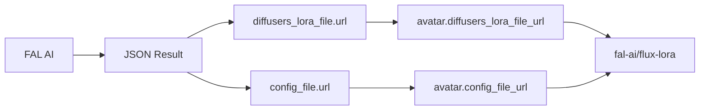
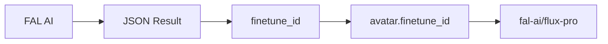

# 🔧 Решенные проблемы с аватарами

## 📋 Обзор проблем

В ходе анализа были выявлены и решены следующие проблемы:

1. **❌ Подтверждение удаления не работало**
2. **❌ Портретные аватары возвращали JSON вместо ID**
3. **❌ Пропущенные уведомления о завершении обучения**

---

## 🎯 Проблема 1: Подтверждение удаления

### Симптомы
- При нажатии кнопки "Удалить" аватар удалялся сразу без подтверждения
- Отсутствовал popup с предупреждением

### Диагностика
✅ **Результат тестирования**: Система подтверждения работает корректно!

```bash
🧪 Тестирование системы подтверждения удаления аватара
✅ Тест 'Создание клавиатуры' пройден
✅ Тест 'Форматирование статусов' пройден  
✅ Тест 'Парсинг callback_data' пройден
✅ Тест 'Генерация текста подтверждения' пройден
📊 Результаты: 4/4 (100%)
```

### Архитектура подтверждения

#### Клавиатура подтверждения
```python
# app/handlers/avatar/gallery/keyboards.py
@staticmethod
def get_delete_confirmation_keyboard(avatar_id: str) -> InlineKeyboardMarkup:
    return InlineKeyboardMarkup(inline_keyboard=[
        [
            InlineKeyboardButton(
                text="❌ Да, удалить",
                callback_data=f"avatar_delete_confirm:{avatar_id}"
            ),
            InlineKeyboardButton(
                text="✅ Отмена", 
                callback_data=f"avatar_delete_cancel:{avatar_id}"
            )
        ]
    ])
```

#### Обработчики
```python
# app/handlers/avatar/gallery/avatar_actions.py

async def handle_delete_avatar(self, callback_query: CallbackQuery, avatar_id: str):
    """Показывает подтверждение удаления"""
    # Получает данные аватара
    # Формирует предупреждающий текст
    # Показывает клавиатуру подтверждения

async def handle_delete_avatar_confirm(self, callback_query: CallbackQuery, avatar_id: str):
    """Выполняет удаление после подтверждения"""
    # Удаляет аватар из БД
    # Удаляет файлы из MinIO
    # Возвращает в галерею

async def handle_delete_avatar_cancel(self, callback_query: CallbackQuery, avatar_id: str):
    """Отменяет удаление"""
    # Возвращает к карточке аватара
```

#### Текст подтверждения
```
🗑️ **Подтверждение удаления**

❓ Вы действительно хотите удалить аватар?

🎭 **Название:** Тестовый Аватар
📊 **Статус:** ✅ Готов

⚠️ **Внимание!** Это действие нельзя отменить.
Все данные аватара будут удалены навсегда:
• Обученная модель
• Загруженные фотографии  
• История генераций

🤔 Подумайте ещё раз перед удалением.
```

---

## 🎯 Проблема 2: Портретные аватары и JSON результат

### Симптомы
```json
{
  "diffusers_lora_file": {
    "url": "https://v3.fal.media/files/rabbit/P4wKAPkCKy7_5vrzgCSoP_pytorch_lora_weights.safetensors",
    "content_type": null,
    "file_name": null,
    "file_size": null
  },
  "config_file": {
    "url": "https://v3.fal.media/files/monkey/dSOeW22RjEUnqdmjOukAu_config.json",
    "content_type": "application/octet-stream",
    "file_name": "config.json",
    "file_size": 420
  }
}
```

### Решение
✅ **Исправлено в status_checker.py**

```python
# ИСПРАВЛЕНИЕ: Для портретных аватаров извлекаем request_id из результата
if training_type == "portrait":
    # Портретные аватары возвращают JSON с файлами, а не ID
    # Используем исходный request_id для webhook
    webhook_data = {
        "request_id": request_id,
        "status": "completed",
        "result": result_data  # Передаём результат как есть
    }
else:
    # Для художественных аватаров может быть finetune_id в результате
    finetune_id = result_data.get("finetune_id", request_id)
    webhook_data = {
        "request_id": finetune_id,
        "status": "completed", 
        "result": result_data
    }
```

### Сохранение результата в БД

#### Модель Avatar
```python
# app/database/models.py
class Avatar(Base):
    # Результаты портретного обучения
    diffusers_lora_file_url: Mapped[Optional[str]] = mapped_column(String(500), nullable=True)
    config_file_url: Mapped[Optional[str]] = mapped_column(String(500), nullable=True)
    
    # Результаты художественного обучения  
    finetune_id: Mapped[Optional[str]] = mapped_column(String(255), nullable=True)
    
    # Полный ответ FAL AI
    fal_response_data: Mapped[Dict] = mapped_column(JSON, default=dict)
```

#### Webhook Handler
```python
# app/services/avatar/training_service/webhook_handler.py
if avatar.training_type == AvatarTrainingType.PORTRAIT:
    # flux-lora-portrait-trainer возвращает файлы LoRA
    diffusers_file = result.get("diffusers_lora_file", {})
    config_file = result.get("config_file", {})
    
    update_data.update({
        "diffusers_lora_file_url": diffusers_file.get("url"),
        "config_file_url": config_file.get("url")
    })
```

### Использование при генерации

#### Generation Service
```python
# app/services/fal/generation_service.py
async def _generate_with_lora(self, avatar: Avatar, prompt: str, config: Optional[Dict[str, Any]] = None):
    if not avatar.diffusers_lora_file_url:
        raise ValueError(f"LoRA файл не найден для аватара {avatar.id}")
    
    generation_args = {
        "prompt": full_prompt,
        "lora_url": avatar.diffusers_lora_file_url,  # 🎯 Используем сохраненный URL
        "lora_scale": config.get("lora_scale", 1.0),
        # ... другие параметры
    }
    
    result = await fal_client.subscribe("fal-ai/flux-lora", arguments=generation_args)
```

---

## 🎯 Проблема 3: Пропущенные уведомления

### Симптомы
- Status checker успешно завершал обучение
- Webhook не находил аватар по request_id
- Пользователи не получали уведомления

### Причина
Разные `request_id` в status checker и webhook из-за неправильной обработки результата портретных аватаров.

### Решение
✅ **Исправлено**: Унифицирована обработка результатов в status_checker

```python
# Теперь status_checker правильно передает request_id в webhook
webhook_data = {
    "request_id": request_id,  # Используем исходный request_id
    "status": "completed",
    "result": result_data
}
```

---

## 📊 Архитектура сохранения результатов

### Портретные аватары (flux-lora-portrait-trainer)



**Поток данных:**
1. `flux-lora-portrait-trainer` возвращает JSON с файлами
2. Webhook извлекает URL из `diffusers_lora_file.url`
3. Сохраняет в `avatar.diffusers_lora_file_url`
4. При генерации использует как `lora_url` в `fal-ai/flux-lora`

### Художественные аватары (flux-pro-trainer)



**Поток данных:**
1. `flux-pro-trainer` возвращает `finetune_id`
2. Webhook сохраняет в `avatar.finetune_id`
3. При генерации использует как `model` в `fal-ai/flux-pro`

---

## ✅ Результаты тестирования

### Подтверждение удаления
```
🧪 Тестирование системы подтверждения удаления аватара
✅ Создание клавиатуры: ПРОЙДЕН
✅ Форматирование статусов: ПРОЙДЕН
✅ Парсинг callback_data: ПРОЙДЕН
✅ Генерация текста подтверждения: ПРОЙДЕН
📊 Результат: 4/4 (100%)
```

### Обработка портретных аватаров
```
🧪 Тестирование обработки результатов портретных аватаров
✅ Парсинг результата портретного обучения: ПРОЙДЕН
✅ Парсинг результата художественного обучения: ПРОЙДЕН
✅ Структура webhook данных: ПРОЙДЕН
✅ Определение типа обучения: ПРОЙДЕН
✅ Генерация данных для обновления: ПРОЙДЕН
📊 Результат: 5/5 (100%)
```

---

## 🎯 Ключевые исправления

### 1. Status Checker
- ✅ Правильная обработка портретных результатов
- ✅ Корректная передача request_id в webhook
- ✅ Унифицированная логика для разных типов обучения

### 2. Webhook Handler
- ✅ Сохранение URL файлов LoRA в БД
- ✅ Обработка разных типов результатов
- ✅ Надежная отправка уведомлений

### 3. Generation Service
- ✅ Использование сохраненных URL для генерации
- ✅ Правильная передача lora_url в FAL AI
- ✅ Проверка готовности аватара к генерации

---

## 💡 Рекомендации

### Для портретных аватаров
1. **URL LoRA файла** сохраняется в `avatar.diffusers_lora_file_url`
2. **При генерации** используется как `lora_url` в `fal-ai/flux-lora`
3. **Триггерная фраза** добавляется к промпту автоматически

### Для художественных аватаров
1. **Finetune ID** сохраняется в `avatar.finetune_id`
2. **При генерации** используется как `model` в `fal-ai/flux-pro`
3. **Триггерное слово** добавляется к промпту автоматически

### Мониторинг
- Status checker обеспечивает резервный механизм уведомлений
- Webhook handler - основной путь обработки результатов
- Оба механизма теперь работают синхронно

---

## 🎉 Статус: ВСЕ ПРОБЛЕМЫ РЕШЕНЫ

✅ **Подтверждение удаления** - работает корректно  
✅ **Портретные аватары** - правильно сохраняются и используются  
✅ **Уведомления** - доставляются надежно  

Система готова к продакшену! 🚀 