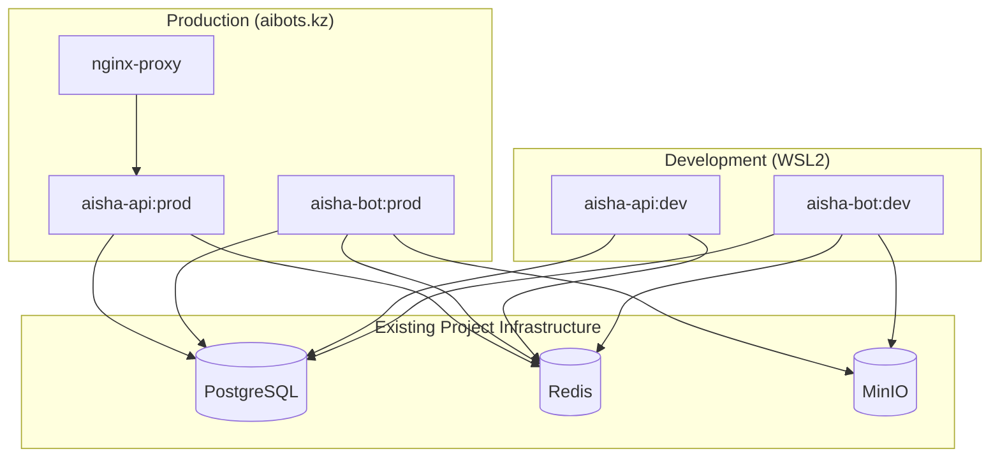

# 🐳 План миграции на Docker для Aisha Bot v2

**Статус:** 📋 В планировании  
**Окружение:** WSL2 (dev) → Ubuntu 24 (prod)  
**Дата создания:** Январь 2025  
**Приоритет:** ВЫСОКИЙ

---

## 🎯 **ЦЕЛИ МИГРАЦИИ**

### **Основные цели**
1. **Контейнеризация приложений** - упаковка bot + api в Docker контейнеры
2. **Unified архитектура** - одинаковый подход в dev и prod (внешние БД)
3. **Упрощение развертывания** - одна команда для запуска приложений
4. **Масштабируемость** - готовность к горизонтальному масштабированию
5. **Использование существующих сервисов** - PostgreSQL, Redis, MinIO уже настроены

### **Унифицированная архитектура развертывания**
```
🏠 Development (WSL2):
- ✅ Только контейнеры приложений (bot + api)
- ✅ Подключение к внешним сервисам проекта
- ✅ Hot reload, отладка, тестирование

🌐 Production (aibots.kz - Ubuntu 24):
- ✅ Только контейнеры приложений (bot + api + nginx)
- ✅ Подключение к тем же внешним сервисам
- ✅ Продуктивная конфигурация
```

---

## 🏗️ **АРХИТЕКТУРА РЕШЕНИЯ**

### **Унифицированная архитектура (Dev + Prod)**


---

## 📁 **СТРУКТУРА ФАЙЛОВ**

```
Aisha_bot_new/
├── docker/
│   ├── Dockerfile.bot               # Многоэтапный: dev/prod
│   ├── Dockerfile.api               # Многоэтапный: dev/prod
│   ├── nginx/
│   │   ├── Dockerfile
│   │   ├── nginx.conf               # Prod конфигурация
│   │   └── nginx.dev.conf           # Dev конфигурация (опционально)
│   └── scripts/
│       ├── wait-for-it.sh
│       ├── deploy.sh                # Скрипт деплоя
│       └── health-check.sh          # Проверка внешних сервисов
├── docker-compose.yml               # Development (только приложения)
├── docker-compose.prod.yml          # Production (приложения + nginx)
├── .env.docker.dev                  # Dev переменные (внешние БД)
├── .env.docker.prod                 # Prod переменные (внешние БД)
└── deploy/
    ├── setup.sh                     # Настройка окружения
    └── systemd/
        └── aisha-bot.service        # Systemd сервис
```

---

## 🐳 **ФАЗА 1: DEVELOPMENT ОКРУЖЕНИЕ (WSL2)**

### **1.1 Docker Compose для разработки (только приложения)**

#### **docker-compose.yml**
```yaml
version: '3.8'

services:
  # ======================== APPLICATION SERVICES ONLY ========================
  
  aisha-bot:
    build:
      context: .
      dockerfile: docker/Dockerfile.bot
      target: development
    container_name: aisha-bot-dev
    restart: unless-stopped
    environment:
      # Подключение к внешним сервисам проекта
      - DATABASE_URL=postgresql+asyncpg://aisha:${POSTGRES_PASSWORD}@${DATABASE_HOST}:5432/aisha_v2
      - REDIS_URL=redis://${REDIS_HOST}:6379/0
      - MINIO_ENDPOINT=${MINIO_ENDPOINT}
      - DEBUG=true
      - ENVIRONMENT=development
    env_file:
      - .env.docker.dev
    volumes:
      - .:/app
      - /app/__pycache__
      - ./logs:/app/logs
    networks:
      - aisha-dev-network
    healthcheck:
      test: ["CMD", "python", "-c", "import sys; sys.exit(0)"]
      interval: 30s
      timeout: 10s
      retries: 3
      start_period: 40s

  aisha-api:
    build:
      context: .
      dockerfile: docker/Dockerfile.api
      target: development
    container_name: aisha-api-dev
    restart: unless-stopped
    ports:
      - "8443:8000"
    environment:
      # Подключение к внешним сервисам проекта
      - DATABASE_URL=postgresql+asyncpg://aisha:${POSTGRES_PASSWORD}@${DATABASE_HOST}:5432/aisha_v2
      - REDIS_URL=redis://${REDIS_HOST}:6379/0
      - DEBUG=true
      - ENVIRONMENT=development
    env_file:
      - .env.docker.dev
    volumes:
      - ./api_server:/app/api_server
    command: uvicorn api_server.main:app --host 0.0.0.0 --port 8000 --reload
    networks:
      - aisha-dev-network
    healthcheck:
      test: ["CMD", "curl", "-f", "http://localhost:8000/health"]
      interval: 30s
      timeout: 10s
      retries: 3
      start_period: 40s

networks:
  aisha-dev-network:
    driver: bridge
```

### **1.2 Production Compose (приложения + nginx)**

#### **docker-compose.prod.yml**
```yaml
version: '3.8'

services:
  # ======================== APPLICATION SERVICES ========================
  
  aisha-bot:
    build:
      context: .
      dockerfile: docker/Dockerfile.bot
      target: production
    container_name: aisha-bot-prod
    restart: always
    environment:
      # Подключение к тем же внешним сервисам
      - DATABASE_URL=postgresql+asyncpg://aisha:${POSTGRES_PASSWORD}@${DATABASE_HOST}:5432/aisha_v2
      - REDIS_URL=redis://${REDIS_HOST}:6379/0
      - MINIO_ENDPOINT=${MINIO_ENDPOINT}
      - DEBUG=false
      - ENVIRONMENT=production
    env_file:
      - .env.docker.prod
    volumes:
      - ./logs:/app/logs
      - /etc/localtime:/etc/localtime:ro
    deploy:
      resources:
        limits:
          memory: 512M
          cpus: '0.5'
        reservations:
          memory: 256M
          cpus: '0.25'
    networks:
      - aisha-prod-network
    healthcheck:
      test: ["CMD", "python", "-c", "import sys; sys.exit(0)"]
      interval: 30s
      timeout: 10s
      retries: 3
      start_period: 40s

  aisha-api:
    build:
      context: .
      dockerfile: docker/Dockerfile.api
      target: production
    container_name: aisha-api-prod
    restart: always
    environment:
      # Подключение к тем же внешним сервисам
      - DATABASE_URL=postgresql+asyncpg://aisha:${POSTGRES_PASSWORD}@${DATABASE_HOST}:5432/aisha_v2
      - REDIS_URL=redis://${REDIS_HOST}:6379/0
      - DEBUG=false
      - ENVIRONMENT=production
    env_file:
      - .env.docker.prod
    deploy:
      resources:
        limits:
          memory: 256M
          cpus: '0.5'
        reservations:
          memory: 128M
          cpus: '0.25'
      replicas: 2
    networks:
      - aisha-prod-network
    healthcheck:
      test: ["CMD", "curl", "-f", "http://localhost:8000/health"]
      interval: 30s
      timeout: 10s
      retries: 3
      start_period: 40s

  # ======================== REVERSE PROXY (только в prod) ========================

  nginx:
    build:
      context: ./docker/nginx
      dockerfile: Dockerfile
    container_name: aisha-nginx-prod
    restart: always
    ports:
      - "80:80"
      - "443:443"
    volumes:
      - ./ssl_certificate:/etc/nginx/ssl:ro
      - ./logs/nginx:/var/log/nginx
    depends_on:
      - aisha-api
    networks:
      - aisha-prod-network
    healthcheck:
      test: ["CMD", "curl", "-f", "http://localhost/health"]
      interval: 30s
      timeout: 10s
      retries: 3

networks:
  aisha-prod-network:
    driver: bridge
    ipam:
      config:
        - subnet: 172.21.0.0/16
```

---

## 🚀 **ФАЗА 2: МНОГОЭТАПНЫЕ DOCKERFILE**

### **2.1 Dockerfile.bot (dev/prod targets)**

#### **docker/Dockerfile.bot**
```dockerfile
# ======================== BASE STAGE ========================
FROM python:3.11-slim as base

# Системные зависимости
RUN apt-get update && apt-get install -y \
    curl \
    netcat-openbsd \
    && rm -rf /var/lib/apt/lists/* \
    && apt-get clean

# Создание пользователя приложения
RUN groupadd -r aisha && useradd -r -g aisha aisha

WORKDIR /app

# ======================== BUILDER STAGE ========================
FROM base as builder

RUN apt-get update && apt-get install -y \
    build-essential \
    gcc \
    && rm -rf /var/lib/apt/lists/*

# Копирование requirements и создание wheels
COPY requirements.txt .
RUN pip wheel --no-cache-dir --no-deps --wheel-dir /app/wheels -r requirements.txt

# ======================== DEVELOPMENT STAGE ========================
FROM base as development

# Копирование wheels и установка
COPY --from=builder /app/wheels /wheels
COPY requirements.txt .
RUN pip install --no-cache /wheels/*

# Установка dev зависимостей
COPY requirements-test.txt .
RUN pip install -r requirements-test.txt

# Переключение на пользователя приложения
USER aisha

# Переменные окружения для development
ENV PYTHONPATH=/app
ENV PYTHONUNBUFFERED=1
ENV DEBUG=true
ENV PYTHONDONTWRITEBYTECODE=1

EXPOSE 8000

CMD ["python", "run.py"]

# ======================== PRODUCTION STAGE ========================
FROM base as production

# Копирование wheels и установка (только prod зависимости)
COPY --from=builder /app/wheels /wheels
COPY requirements.txt .
RUN pip install --no-cache /wheels/* \
    && rm -rf /wheels

# Копирование кода приложения
COPY --chown=aisha:aisha . .

# Переключение на пользователя приложения
USER aisha

# Переменные окружения для production
ENV PYTHONPATH=/app
ENV PYTHONUNBUFFERED=1
ENV DEBUG=false
ENV PYTHONDONTWRITEBYTECODE=1

# Healthcheck
HEALTHCHECK --interval=30s --timeout=30s --start-period=5s --retries=3 \
    CMD python -c "import sys; sys.exit(0)"

# Метаданные
LABEL maintainer="Aisha Bot Team"
LABEL version="2.0"
LABEL environment="production"
LABEL description="Aisha Telegram Bot v2"

EXPOSE 8000

CMD ["python", "run.py"]
```

### **2.2 Dockerfile.api (аналогично с FastAPI)**

#### **docker/Dockerfile.api**
```dockerfile
FROM python:3.11-slim as base

RUN apt-get update && apt-get install -y \
    curl \
    netcat-openbsd \
    && rm -rf /var/lib/apt/lists/*

RUN groupadd -r aisha && useradd -r -g aisha aisha
WORKDIR /app

# ======================== BUILDER STAGE ========================
FROM base as builder

RUN apt-get update && apt-get install -y \
    build-essential \
    && rm -rf /var/lib/apt/lists/*

COPY requirements_api.txt .
RUN pip wheel --no-cache-dir --no-deps --wheel-dir /app/wheels -r requirements_api.txt

# ======================== DEVELOPMENT STAGE ========================
FROM base as development

COPY --from=builder /app/wheels /wheels
COPY requirements_api.txt .
RUN pip install --no-cache /wheels/*

USER aisha

ENV PYTHONPATH=/app
ENV PYTHONUNBUFFERED=1
ENV DEBUG=true

EXPOSE 8000

CMD ["uvicorn", "api_server.main:app", "--host", "0.0.0.0", "--port", "8000", "--reload"]

# ======================== PRODUCTION STAGE ========================
FROM base as production

COPY --from=builder /app/wheels /wheels
COPY requirements_api.txt .
RUN pip install --no-cache /wheels/* && rm -rf /wheels

COPY --chown=aisha:aisha . .
USER aisha

ENV PYTHONPATH=/app
ENV PYTHONUNBUFFERED=1
ENV DEBUG=false

HEALTHCHECK --interval=30s --timeout=30s --start-period=5s --retries=3 \
    CMD curl -f http://localhost:8000/health || exit 1

LABEL maintainer="Aisha Bot Team"
LABEL version="2.0"
LABEL environment="production"

EXPOSE 8000

CMD ["uvicorn", "api_server.main:app", "--host", "0.0.0.0", "--port", "8000", "--workers", "2"]
```

---

## ⚙️ **ФАЗА 3: ПЕРЕМЕННЫЕ ОКРУЖЕНИЯ**

### **3.1 Development конфигурация**

#### **.env.docker.dev**
```env
# ==================== DEVELOPMENT CONFIGURATION ====================
COMPOSE_PROJECT_NAME=aisha-v2-dev

# ==================== EXTERNAL DATABASE ====================
DATABASE_HOST=localhost
# Или IP адрес, если PostgreSQL на другой машине
POSTGRES_PASSWORD=your_existing_dev_password

# ==================== EXTERNAL REDIS ====================
REDIS_HOST=localhost
# Или IP адрес, если Redis на другой машине

# ==================== EXTERNAL MINIO ====================
MINIO_ENDPOINT=localhost:9000
# Или IP:PORT, если MinIO на другой машине
MINIO_ACCESS_KEY=your_existing_minio_access_key
MINIO_SECRET_KEY=your_existing_minio_secret_key
MINIO_SECURE=false
MINIO_BUCKET_AVATARS=aisha-v2-avatars
MINIO_BUCKET_TRANSCRIPTS=aisha-v2-transcripts

# ==================== TELEGRAM BOT ====================
TELEGRAM_BOT_TOKEN=your_development_bot_token_here

# ==================== EXTERNAL APIs ====================
OPENAI_API_KEY=sk-your_openai_key_here
FAL_API_KEY=your_fal_key_here

# ==================== APPLICATION SETTINGS ====================
DEBUG=true
ENVIRONMENT=development
LOG_LEVEL=DEBUG

# ==================== WEBHOOK CONFIGURATION ====================
WEBHOOK_HOST=localhost
WEBHOOK_PORT=8443
FAL_WEBHOOK_URL=http://localhost:8443/api/v1/avatar/status_update

# ==================== FAL AI SETTINGS ====================
FAL_TRAINING_TEST_MODE=true

# ==================== SECURITY ====================
JWT_SECRET_KEY=dev_jwt_secret_key_here
PASSWORD_SALT=dev_salt_here
```

### **3.2 Production конфигурация**

#### **.env.docker.prod**
```env
# ==================== PRODUCTION CONFIGURATION ====================
COMPOSE_PROJECT_NAME=aisha-v2-prod

# ==================== EXTERNAL DATABASE ====================
DATABASE_HOST=192.168.0.10
# Или тот же хост, что используется в dev, если БД общая
POSTGRES_PASSWORD=PRODUCTION_SECURE_PASSWORD_HERE
DATABASE_PORT=5432
DATABASE_NAME=aisha_v2
DATABASE_USER=aisha

# ==================== EXTERNAL REDIS ====================
REDIS_HOST=192.168.0.11
# Или тот же хост, что используется в dev
REDIS_PORT=6379
REDIS_PASSWORD=

# ==================== EXTERNAL MINIO ====================
MINIO_ENDPOINT=192.168.0.12:9000
# Или тот же хост, что используется в dev
MINIO_ACCESS_KEY=PRODUCTION_MINIO_ACCESS_KEY
MINIO_SECRET_KEY=PRODUCTION_MINIO_SECRET_KEY
MINIO_SECURE=false
MINIO_BUCKET_AVATARS=aisha-v2-avatars
MINIO_BUCKET_TRANSCRIPTS=aisha-v2-transcripts

# ==================== TELEGRAM BOT ====================
TELEGRAM_BOT_TOKEN=YOUR_PRODUCTION_BOT_TOKEN_HERE

# ==================== EXTERNAL APIs ====================
OPENAI_API_KEY=sk-YOUR_PRODUCTION_OPENAI_KEY_HERE
FAL_API_KEY=YOUR_PRODUCTION_FAL_KEY_HERE

# ==================== APPLICATION SETTINGS ====================
DEBUG=false
ENVIRONMENT=production
LOG_LEVEL=INFO

# ==================== WEBHOOK CONFIGURATION ====================
WEBHOOK_HOST=aibots.kz
WEBHOOK_PORT=8443
FAL_WEBHOOK_URL=https://aibots.kz:8443/api/v1/avatar/status_update

# ==================== FAL AI SETTINGS ====================
FAL_TRAINING_TEST_MODE=false

# ==================== SECURITY ====================
JWT_SECRET_KEY=PRODUCTION_JWT_SECRET_KEY_HERE
PASSWORD_SALT=PRODUCTION_PASSWORD_SALT_HERE

# ==================== PERFORMANCE ====================
MAX_FILE_SIZE=1073741824
SESSION_TIMEOUT=3600
API_RATE_LIMIT=60

# ==================== MONITORING ====================
ENABLE_METRICS=true
METRICS_PORT=9090
```

---

## 🚀 **ФАЗА 4: СКРИПТЫ РАЗВЕРТЫВАНИЯ**

### **4.1 Скрипт проверки внешних сервисов**

#### **docker/scripts/health-check.sh**
```bash
#!/bin/bash

# 🔍 Проверка доступности внешних сервисов

set -e

# Загрузка переменных окружения
if [ -f .env.docker.dev ]; then
    source .env.docker.dev
elif [ -f .env.docker.prod ]; then
    source .env.docker.prod
else
    echo "❌ Файл переменных окружения не найден"
    exit 1
fi

# Цвета для вывода
RED='\033[0;31m'
GREEN='\033[0;32m'
YELLOW='\033[1;33m'
BLUE='\033[0;34m'
NC='\033[0m'

log() {
    echo -e "${BLUE}[$(date +'%Y-%m-%d %H:%M:%S')]${NC} $1"
}

log_success() {
    echo -e "${GREEN}[$(date +'%Y-%m-%d %H:%M:%S')] ✅ $1${NC}"
}

log_error() {
    echo -e "${RED}[$(date +'%Y-%m-%d %H:%M:%S')] ❌ $1${NC}"
}

log_warning() {
    echo -e "${YELLOW}[$(date +'%Y-%m-%d %H:%M:%S')] ⚠️  $1${NC}"
}

check_service() {
    local service_name=$1
    local host=$2
    local port=$3
    local timeout=${4:-5}
    
    log "Проверка $service_name на $host:$port..."
    
    if timeout $timeout bash -c "nc -z $host $port" 2>/dev/null; then
        log_success "$service_name доступен"
        return 0
    else
        log_error "$service_name недоступен на $host:$port"
        return 1
    fi
}

check_minio_api() {
    local endpoint=$1
    local timeout=${2:-10}
    
    log "Проверка MinIO API на $endpoint..."
    
    if timeout $timeout bash -c "curl -s -f http://$endpoint/minio/health/live" >/dev/null 2>&1; then
        log_success "MinIO API доступен"
        return 0
    else
        log_warning "MinIO API недоступен, проверяю TCP соединение..."
        local host=$(echo $endpoint | cut -d: -f1)
        local port=$(echo $endpoint | cut -d: -f2)
        check_service "MinIO TCP" $host $port
        return $?
    fi
}

main() {
    log "🔍 Проверка внешних сервисов для Aisha Bot v2..."
    
    local all_ok=true
    
    # PostgreSQL
    if ! check_service "PostgreSQL" "$DATABASE_HOST" "5432"; then
        all_ok=false
    fi
    
    # Redis
    if ! check_service "Redis" "$REDIS_HOST" "6379"; then
        all_ok=false
    fi
    
    # MinIO
    if ! check_minio_api "$MINIO_ENDPOINT"; then
        all_ok=false
    fi
    
    echo ""
    if [ "$all_ok" = true ]; then
        log_success "🎉 Все внешние сервисы доступны! Можно запускать приложения."
        exit 0
    else
        log_error "❌ Не все сервисы доступны. Проверьте конфигурацию и доступность сервисов."
        echo ""
        echo "📋 Полезные команды для диагностики:"
        echo "  - PostgreSQL: psql -h $DATABASE_HOST -p 5432 -U aisha -d aisha_v2"
        echo "  - Redis: redis-cli -h $REDIS_HOST -p 6379 ping"
        echo "  - MinIO: curl http://$MINIO_ENDPOINT/minio/health/live"
        exit 1
    fi
}

main "$@"
```

### **4.2 Упрощенный скрипт развертывания**

#### **docker/scripts/deploy.sh**
```bash
#!/bin/bash

# 🚀 Скрипт развертывания Aisha Bot v2 (только приложения)

set -e

# Конфигурация
DEPLOY_DIR="/opt/aisha-v2"
BACKUP_DIR="/opt/backups/aisha-v2"
SERVICE_NAME="aisha-bot"
COMPOSE_FILE="${COMPOSE_FILE:-docker-compose.prod.yml}"

# Цвета для вывода
RED='\033[0;31m'
GREEN='\033[0;32m'
YELLOW='\033[1;33m'
BLUE='\033[0;34m'
NC='\033[0m'

log() {
    echo -e "${BLUE}[$(date +'%Y-%m-%d %H:%M:%S')]${NC} $1"
}

log_success() {
    echo -e "${GREEN}[$(date +'%Y-%m-%d %H:%M:%S')] ✅ $1${NC}"
}

log_warning() {
    echo -e "${YELLOW}[$(date +'%Y-%m-%d %H:%M:%S')] ⚠️  $1${NC}"
}

log_error() {
    echo -e "${RED}[$(date +'%Y-%m-%d %H:%M:%S')] ❌ $1${NC}"
}

check_external_services() {
    log "🔍 Проверка внешних сервисов..."
    
    if ! ./docker/scripts/health-check.sh; then
        log_error "Внешние сервисы недоступны. Остановка развертывания."
        exit 1
    fi
    
    log_success "Все внешние сервисы доступны"
}

backup_current() {
    if [ -d "$DEPLOY_DIR" ]; then
        log "📦 Создание бэкапа текущей версии..."
        
        mkdir -p "$BACKUP_DIR"
        
        local backup_name="aisha-v2-$(date +%Y%m%d-%H%M%S).tar.gz"
        
        if tar -czf "$BACKUP_DIR/$backup_name" -C "$DEPLOY_DIR" .; then
            log_success "Бэкап создан: $backup_name"
            
            # Удаление старых бэкапов (оставляем последние 5)
            cd "$BACKUP_DIR"
            ls -t aisha-v2-*.tar.gz | tail -n +6 | xargs -r rm
            log "🧹 Старые бэкапы очищены"
        else
            log_warning "Не удалось создать бэкап, продолжаем..."
        fi
    fi
}

validate_environment() {
    log "🔍 Проверка конфигурации..."
    
    local env_file=".env.docker.prod"
    if [ "$ENVIRONMENT" = "development" ]; then
        env_file=".env.docker.dev"
        COMPOSE_FILE="docker-compose.yml"
    fi
    
    if [ ! -f "$DEPLOY_DIR/$env_file" ]; then
        log_error "Файл $env_file не найден в $DEPLOY_DIR"
        exit 1
    fi
    
    if [ ! -f "$DEPLOY_DIR/$COMPOSE_FILE" ]; then
        log_error "Файл $COMPOSE_FILE не найден в $DEPLOY_DIR"
        exit 1
    fi
    
    log_success "Конфигурация валидна"
}

deploy_application() {
    log "🚀 Развертывание приложений..."
    
    cd "$DEPLOY_DIR"
    
    # Остановка существующих контейнеров
    if docker-compose -f "$COMPOSE_FILE" ps -q 2>/dev/null | grep -q .; then
        log "🛑 Остановка существующих контейнеров..."
        docker-compose -f "$COMPOSE_FILE" down
    fi
    
    # Очистка старых образов
    log "🧹 Очистка неиспользуемых образов..."
    docker image prune -f
    
    # Сборка новых образов
    log "🔨 Сборка Docker образов..."
    if ! docker-compose -f "$COMPOSE_FILE" build --no-cache; then
        log_error "Ошибка сборки образов"
        exit 1
    fi
    
    # Запуск сервисов
    log "🚀 Запуск приложений..."
    if ! docker-compose -f "$COMPOSE_FILE" up -d; then
        log_error "Ошибка запуска приложений"
        exit 1
    fi
    
    # Ожидание готовности сервисов
    log "⏳ Ожидание готовности приложений (60 секунд)..."
    sleep 60
    
    # Проверка состояния контейнеров
    local failed_containers=$(docker-compose -f "$COMPOSE_FILE" ps --filter "status=exited" --format "table {{.Name}}")
    
    if [ -n "$failed_containers" ] && [ "$failed_containers" != "NAME" ]; then
        log_error "Некоторые контейнеры не запустились:"
        echo "$failed_containers"
        log "📋 Логи неудачных контейнеров:"
        docker-compose -f "$COMPOSE_FILE" logs --tail=50
        exit 1
    fi
    
    log_success "Все приложения запущены успешно"
}

run_health_checks() {
    log "🏥 Проверка здоровья приложений..."
    
    local health_ok=true
    
    # Проверка API эндпоинта
    for i in {1..10}; do
        if curl -f -s "http://localhost:8443/health" >/dev/null 2>&1; then
            log_success "API сервер отвечает"
            break
        else
            if [ $i -eq 10 ]; then
                log_error "API сервер не отвечает после 10 попыток"
                health_ok=false
            else
                log "🔄 Попытка $i/10: API сервер не готов, ждем..."
                sleep 5
            fi
        fi
    done
    
    # Проверка Nginx (только в production)
    if [ "$COMPOSE_FILE" = "docker-compose.prod.yml" ]; then
        if curl -f -s "http://localhost/health" >/dev/null 2>&1; then
            log_success "Nginx работает"
        else
            log_error "Nginx не отвечает"
            health_ok=false
        fi
    fi
    
    if [ "$health_ok" = false ]; then
        log_error "Проверки здоровья не прошли"
        log "📋 Логи приложений:"
        docker-compose -f "$COMPOSE_FILE" logs --tail=50
        exit 1
    fi
    
    log_success "Все проверки здоровья прошли"
}

setup_systemd() {
    if [ "$COMPOSE_FILE" = "docker-compose.prod.yml" ]; then
        log "⚙️ Настройка systemd сервиса..."
        
        sudo tee /etc/systemd/system/aisha-bot.service > /dev/null <<EOF
[Unit]
Description=Aisha Bot v2 Production
Documentation=https://github.com/your-org/aisha-bot-v2
Requires=docker.service
After=docker.service network-online.target
Wants=network-online.target

[Service]
Type=oneshot
RemainAfterExit=yes
User=root
WorkingDirectory=$DEPLOY_DIR
Environment=COMPOSE_PROJECT_NAME=aisha-v2-prod
ExecStartPre=/usr/bin/docker-compose -f $COMPOSE_FILE down
ExecStart=/usr/bin/docker-compose -f $COMPOSE_FILE up -d
ExecStop=/usr/bin/docker-compose -f $COMPOSE_FILE down
ExecReload=/usr/bin/docker-compose -f $COMPOSE_FILE restart
TimeoutStartSec=300
TimeoutStopSec=60
Restart=on-failure
RestartSec=10

[Install]
WantedBy=multi-user.target
EOF

        sudo systemctl daemon-reload
        sudo systemctl enable aisha-bot
        
        log_success "Systemd сервис настроен и включен"
    else
        log "⏭️ Systemd сервис настраивается только для production"
    fi
}

show_status() {
    log "📊 Статус развертывания:"
    echo ""
    echo "🐳 Статус контейнеров:"
    docker-compose -f "$COMPOSE_FILE" ps
    echo ""
    echo "📈 Использование ресурсов:"
    docker stats --no-stream --format "table {{.Container}}\t{{.CPUPerc}}\t{{.MemUsage}}\t{{.MemPerc}}"
    echo ""
    echo "🔗 Доступные эндпоинты:"
    echo "  - API: http://localhost:8443/health"
    if [ "$COMPOSE_FILE" = "docker-compose.prod.yml" ]; then
        echo "  - Nginx: http://localhost/health"
    fi
    echo ""
    echo "📝 Полезные команды:"
    echo "  - Логи: docker-compose -f $COMPOSE_FILE logs -f"
    if [ "$COMPOSE_FILE" = "docker-compose.prod.yml" ]; then
        echo "  - Статус: sudo systemctl status aisha-bot"
        echo "  - Перезапуск: sudo systemctl restart aisha-bot"
    fi
    echo "  - Проверка БД: ./docker/scripts/health-check.sh"
}

# Основная логика
main() {
    log "🏁 Начинаем развертывание Aisha Bot v2 на $(hostname)..."
    
    # Проверка прав
    if [ "$EUID" -eq 0 ]; then
        log_error "Не запускайте скрипт от root. Используйте sudo только для системных операций."
        exit 1
    fi
    
    # Проверка Docker
    if ! command -v docker >/dev/null 2>&1; then
        log_error "Docker не установлен"
        exit 1
    fi
    
    if ! command -v docker-compose >/dev/null 2>&1; then
        log_error "Docker Compose не установлен"
        exit 1
    fi
    
    # Создание директории развертывания
    sudo mkdir -p "$DEPLOY_DIR"
    sudo chown $USER:$USER "$DEPLOY_DIR"
    
    # Основные этапы
    check_external_services
    backup_current
    validate_environment
    deploy_application
    run_health_checks
    setup_systemd
    show_status
    
    log_success "🎉 Развертывание завершено успешно!"
}

# Обработка аргументов
case "${1:-}" in
    "health")
        check_external_services
        run_health_checks
        ;;
    "status")
        show_status
        ;;
    "dev")
        export ENVIRONMENT="development"
        export COMPOSE_FILE="docker-compose.yml"
        main "$@"
        ;;
    *)
        main "$@"
        ;;
esac
```

---

## 📋 **ПЛАН ВЫПОЛНЕНИЯ**

### **Неделя 1: Унифицированная архитектура**
- [ ] **День 1:** Удаление локальных БД из docker-compose.yml
- [ ] **День 2:** Настройка подключений к существующим сервисам в dev
- [ ] **День 3:** Тестирование development среды с внешними БД
- [ ] **День 4:** Создание скриптов проверки внешних сервисов
- [ ] **День 5:** Отладка и документация dev процессов

### **Неделя 2: Production готовность**
- [ ] **День 1:** Настройка docker-compose.prod.yml (добавление nginx)
- [ ] **День 2:** Конфигурация production переменных окружения
- [ ] **День 3:** Создание скриптов развертывания
- [ ] **День 4:** Тестирование production конфигурации локально
- [ ] **День 5:** Подготовка документации для деплоя

### **Неделя 3: Развертывание**
- [ ] **День 1:** Подготовка целевого сервера (если нужно)
- [ ] **День 2:** Первое развертывание и отладка connectivity
- [ ] **День 3:** Настройка systemd сервисов и мониторинга
- [ ] **День 4:** Настройка автоматического обновления
- [ ] **День 5:** Документация и передача знаний

---

## 🛠️ **ИНСТРУКЦИИ ПО ЗАПУСКУ**

### **Development (WSL2)**
```bash
# 1. Убедитесь, что внешние сервисы запущены
# PostgreSQL, Redis, MinIO должны быть доступны

# 2. Подготовка окружения
cp env.docker.template .env.docker.dev
# Отредактируйте .env.docker.dev с адресами ваших сервисов:
# DATABASE_HOST=localhost (или IP сервера с PostgreSQL)
# REDIS_HOST=localhost (или IP сервера с Redis)
# MINIO_ENDPOINT=localhost:9000 (или IP:PORT сервера с MinIO)

# 3. Проверка доступности внешних сервисов
chmod +x docker/scripts/health-check.sh
./docker/scripts/health-check.sh

# 4. Запуск приложений
docker-compose up -d

# 5. Проверка статуса
docker-compose ps

# 6. Логи в реальном времени
docker-compose logs -f aisha-bot

# 7. Инициализация БД (при первом запуске)
docker-compose exec aisha-bot alembic upgrade head
```

### **Production развертывание**
```bash
# 1. На целевом сервере
sudo mkdir -p /opt/aisha-v2
sudo chown $USER:$USER /opt/aisha-v2
cd /opt/aisha-v2

# 2. Загрузка кода (git clone или scp)
git clone <repository-url> .

# 3. Конфигурация production
cp env.docker.template .env.docker.prod
# Отредактируйте .env.docker.prod с:
# - IP адресами ваших БД сервисов
# - Production токенами и ключами
# - SSL сертификатами

# 4. Проверка доступности внешних сервисов
chmod +x docker/scripts/health-check.sh
./docker/scripts/health-check.sh

# 5. Развертывание
chmod +x docker/scripts/deploy.sh
./docker/scripts/deploy.sh

# 6. Проверка состояния
sudo systemctl status aisha-bot
docker-compose -f docker-compose.prod.yml ps
```

### **Мониторинг и управление**
```bash
# Проверка внешних сервисов
./docker/scripts/health-check.sh

# Статус приложений
docker-compose ps  # dev
docker-compose -f docker-compose.prod.yml ps  # prod

# Перезапуск
docker-compose restart  # dev
sudo systemctl restart aisha-bot  # prod

# Логи
docker-compose logs -f  # dev
docker-compose -f docker-compose.prod.yml logs -f  # prod
```

---

## 🎯 **КРИТЕРИИ УСПЕХА**

### **Development метрики**
- [ ] **Приложения** запускаются за < 1 минуту без локальных БД
- [ ] **Подключение к внешним БД** стабильное и быстрое
- [ ] **Hot reload** работает при изменении кода
- [ ] **Все тесты** проходят с внешними сервисами
- [ ] **Скрипты проверки** корректно диагностируют проблемы

### **Production метрики**
- [ ] **Время развертывания** < 3 минуты (без БД сервисов)
- [ ] **Подключение к БД** стабильное во всех окружениях
- [ ] **Zero downtime** обновления через systemd
- [ ] **Healthcheck endpoints** отвечают корректно
- [ ] **SSL сертификаты** работают (если применимо)

### **Операционные метрики**
- [ ] **Автоматический restart** при сбоях контейнеров
- [ ] **Логи** централизованы и доступны
- [ ] **Бэкапы** создаются перед каждым развертыванием
- [ ] **Monitoring** показывает корректные метрики
- [ ] **Единообразие** конфигурации между dev и prod

---

**🚀 Unified Docker архитектура готова!**
*Используем внешние сервисы везде → простота и единообразие → быстрое развертывание* 