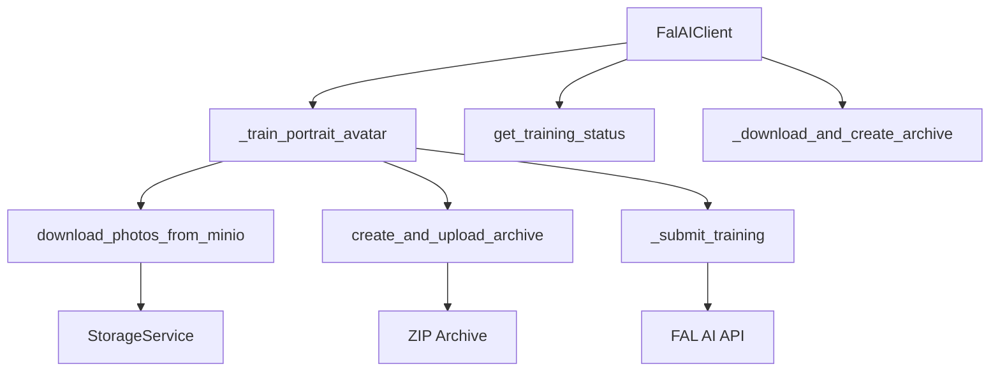

# FAL AI Client - Документация

**Файл:** `app/services/fal/client.py`  
**Класс:** `FalAIClient`  
**Назначение:** Клиент для интеграции с FAL AI сервисом обучения аватаров

## Описание

`FalAIClient` является основным интерфейсом для взаимодействия с FAL AI сервисом для обучения портретных аватаров. Класс инкапсулирует всю логику загрузки фотографий, создания архивов, запуска обучения и получения статуса.

## Архитектура



## Основные методы

### `__init__(self)`
Инициализирует клиент с настройками из конфигурации.

**Настройки:**
- `test_mode`: Режим тестирования (из `settings.AVATAR_TEST_MODE`)
- `api_key`: API ключ FAL AI (из `settings.FAL_API_KEY`)

**Пример:**
```python
client = FalAIClient()
print(f"Test mode: {client.test_mode}")
```

### `async def train_avatar(user_id, avatar_id, name, gender, photo_urls, training_config)`
Основной метод для запуска обучения аватара.

**Параметры:**
- `user_id` (UUID): Идентификатор пользователя
- `avatar_id` (UUID): Идентификатор аватара
- `name` (str): Имя аватара
- `gender` (str): Пол аватара ('male'/'female')
- `photo_urls` (List[str]): Список URL фотографий в MinIO
- `training_config` (Optional[Dict]): Конфигурация обучения

**Возвращает:**
- `Optional[str]`: request_id обучения или None при ошибке

**Пример:**
```python
request_id = await client.train_avatar(
    user_id=user_id,
    avatar_id=avatar_id,
    name="Анна",
    gender="female",
    photo_urls=["avatars/user/avatar/photo1.jpg"],
    training_config={"quality": "high"}
)
```

### `async def get_training_status(request_id, training_type)`
Получает статус обучения модели.

**Параметры:**
- `request_id` (str): Идентификатор запроса обучения
- `training_type` (str): Тип обучения ("portrait")

**Возвращает:**
- `Dict[str, Any]`: Словарь со статусом обучения

**Формат ответа:**
```python
{
    "status": "completed|in_progress|error",
    "progress": 100,  # 0-100
    "message": "Training completed successfully",
    "created_at": "2025-05-23T16:00:00Z",
    "completed_at": "2025-05-23T16:30:00Z"
}
```

### `async def _train_portrait_avatar(data_url, user_id, avatar_id, config)`
Внутренний метод для запуска обучения портретного аватара.

**Параметры:**
- `data_url` (str): URL архива с фотографиями
- `user_id` (UUID): ID пользователя
- `avatar_id` (UUID): ID аватара
- `config` (Dict): Конфигурация обучения

**Возвращает:**
- `Optional[str]`: request_id обучения

## Обработка фотографий

### `async def download_photos_from_minio(photo_urls, avatar_id)`
Скачивает фотографии из MinIO хранилища.

**Особенности:**
- Валидирует каждое изображение
- Конвертирует в RGB формат
- Сохраняет в JPEG с качеством 95%
- Пропускает поврежденные файлы

### `async def create_and_upload_archive(photo_paths, avatar_id)`
Создает ZIP архив и загружает его в FAL AI.

**Процесс:**
1. Создает ZIP архив с фотографиями
2. Загружает архив в временное хранилище
3. Возвращает URL для FAL AI

## Конфигурация

### Настройки обучения
```python
default_config = {
    "steps": 1000,
    "learning_rate": 0.0002,
    "multiresolution_training": True,
    "subject_crop": True,
    "create_masks": False,
    "webhook_url": settings.FAL_WEBHOOK_URL
}
```

### Тестовый режим
В тестовом режиме:
- Не отправляются реальные запросы к FAL AI
- Возвращаются мок-данные
- Экономятся API вызовы

## Обработка ошибок

Класс обрабатывает следующие типы ошибок:
- **Сетевые ошибки**: Timeout, connection errors
- **Ошибки API**: Неверные параметры, лимиты
- **Ошибки данных**: Поврежденные изображения
- **Ошибки хранилища**: Недоступность MinIO

**Пример обработки:**
```python
try:
    request_id = await client.train_avatar(...)
    if request_id:
        print(f"Обучение запущено: {request_id}")
    else:
        print("Ошибка запуска обучения")
except Exception as e:
    logger.exception(f"Критическая ошибка: {e}")
```

## Интеграция с другими сервисами

### StorageService
- Скачивание фотографий из MinIO
- Загрузка архивов

### FALGenerationService
- Генерация изображений с обученными моделями

### AvatarTrainingService
- Координация процесса обучения

## Мониторинг и логирование

Все операции логируются с префиксом `[FAL AI]`:
- **INFO**: Успешные операции
- **WARNING**: Проблемы с отдельными фото
- **ERROR**: Критические ошибки
- **DEBUG**: Детальная отладочная информация

## Лучшие практики

1. **Валидация входных данных:**
   ```python
   if not photo_urls:
       raise ValueError("Список фотографий не может быть пустым")
   ```

2. **Обработка таймаутов:**
   ```python
   async with aiohttp.ClientSession(timeout=ClientTimeout(total=300)) as session:
       # API вызовы
   ```

3. **Очистка временных файлов:**
   ```python
   try:
       # Работа с файлами
   finally:
       await self._cleanup_temp_files()
   ```

4. **Мониторинг прогресса:**
   ```python
   status = await client.get_training_status(request_id, "portrait")
   print(f"Прогресс: {status['progress']}%")
   ```

## Статусы обучения

| Статус | Описание | Действия |
|--------|----------|----------|
| `in_progress` | Обучение в процессе | Ожидание завершения |
| `completed` | Обучение завершено | Модель готова к использованию |
| `error` | Ошибка обучения | Анализ логов, повторная попытка |
| `unknown` | Неизвестный статус | Проверка connectivity |

## Примеры использования

### Полный цикл обучения:
```python
# 1. Создание клиента
client = FalAIClient()

# 2. Запуск обучения
request_id = await client.train_avatar(
    user_id=UUID("..."),
    avatar_id=UUID("..."),
    name="Мария",
    gender="female",
    photo_urls=["avatars/user1/avatar1/photo1.jpg"],
    training_config={"quality": "balanced"}
)

# 3. Мониторинг прогресса
while True:
    status = await client.get_training_status(request_id, "portrait")
    if status["status"] == "completed":
        print("Обучение завершено!")
        break
    elif status["status"] == "error":
        print(f"Ошибка: {status['message']}")
        break
    
    await asyncio.sleep(30)  # Проверяем каждые 30 секунд
```

## Совместимость

- **Python**: 3.11+
- **AsyncIO**: Полная поддержка
- **FAL AI API**: v1.0+
- **aiohttp**: 3.8+

## См. также

- [FAL Generation Service](./FALGenerationService.md)
- [Avatar Training Service](./AvatarTrainingService.md)
- [Test Mode Simulator](./TestModeSimulator.md) 