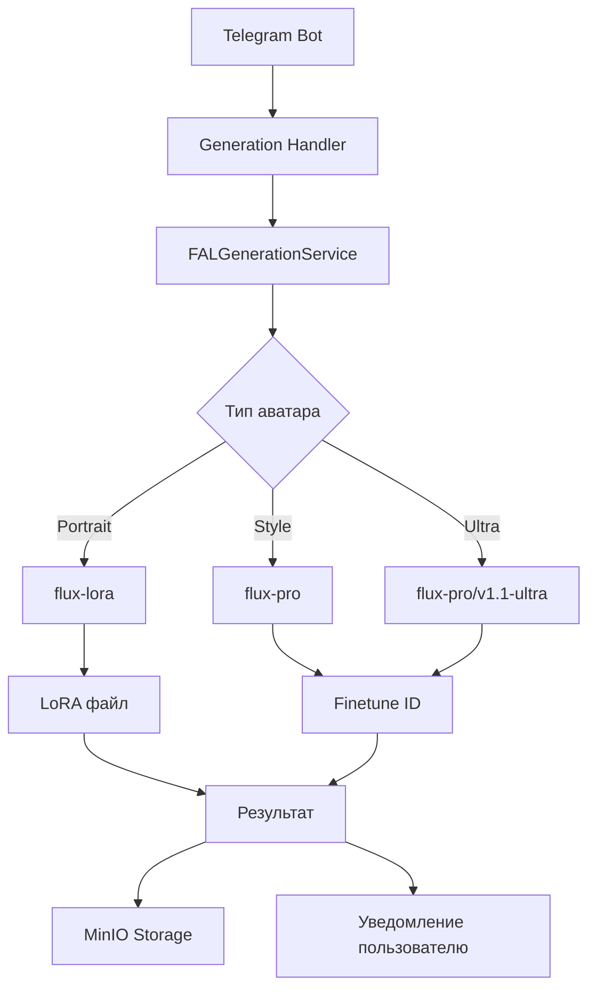

# 🎨 Генерация изображений с аватарами

## 📋 Обзор

Система генерации изображений в Aisha Bot поддерживает создание персонализированных изображений с использованием обученных аватаров. Основана на **FLUX.1 [dev]** - модели нового поколения для генерации изображений по текстовому описанию.

### 🎯 Поддерживаемые типы аватаров

1. **🎭 Портретные аватары** → `fal-ai/flux-lora` (LoRA файлы)
2. **🎨 Стилевые аватары** → `fal-ai/flux-pro` (Finetune ID)
3. **⚡ Ultra качество** → `fal-ai/flux-pro/v1.1-ultra-finetuned` (2K разрешение)

---

## 🚀 FLUX.1 [dev] API

### Установка клиента

```bash
pip install fal-client
```

### Настройка API ключа

```bash
export FAL_KEY="YOUR_API_KEY"
```

### Базовый пример генерации

```python
import asyncio
import fal_client

async def generate_image():
    handler = await fal_client.submit_async(
        "fal-ai/flux-lora",
        arguments={
            "prompt": "Extreme close-up of a single tiger eye, direct frontal view. Detailed iris and pupil. Sharp focus on eye texture and color. Natural lighting to capture authentic eye shine and depth. The word \"FLUX\" is painted over it in big, white brush strokes with visible texture.",
            "lora_url": "https://example.com/lora_weights.safetensors",
            "lora_scale": 1.0,
            "image_size": "square_hd",
            "num_inference_steps": 28,
            "guidance_scale": 3.5
        },
    )

    async for event in handler.iter_events(with_logs=True):
        print(event)

    result = await handler.get()
    return result["images"][0]["url"]

if __name__ == "__main__":
    image_url = asyncio.run(generate_image())
    print(f"Generated image: {image_url}")
```

---

## 🏗️ Архитектура системы

### Компоненты



### Основные классы

1. **`FALGenerationService`** - основной сервис генерации
2. **`AvatarService`** - управление аватарами
3. **`GenerationHandler`** - Telegram обработчики
4. **`MinIOService`** - хранение результатов

---

## 🎭 Портретные аватары (LoRA)

### Принцип работы

Портретные аватары используют **LoRA (Low-Rank Adaptation)** файлы для персонализации модели FLUX.1:

```python
# Структура результата обучения портретного аватара
{
  "diffusers_lora_file": {
    "url": "https://v3.fal.media/files/rabbit/P4wKAPkCKy7_5vrzgCSoP_pytorch_lora_weights.safetensors",
    "content_type": null,
    "file_name": null,
    "file_size": null
  },
  "config_file": {
    "url": "https://v3.fal.media/files/monkey/dSOeW22RjEUnqdmjOukAu_config.json",
    "content_type": "application/octet-stream",
    "file_name": "config.json",
    "file_size": 420
  }
}
```

### Генерация с LoRA

```python
from app.services.fal.generation_service import FALGenerationService

async def generate_portrait_image(avatar_id: str, prompt: str):
    """Генерация изображения с портретным аватаром"""
    
    # Получаем аватар из БД
    avatar = await avatar_service.get_avatar(avatar_id)
    
    # Проверяем что это портретный аватар
    if avatar.training_type != AvatarTrainingType.PORTRAIT:
        raise ValueError("Аватар не является портретным")
    
    # Проверяем наличие LoRA файла
    if not avatar.diffusers_lora_file_url:
        raise ValueError("LoRA файл не найден")
    
    # Создаем сервис генерации
    generation_service = FALGenerationService()
    
    # Генерируем изображение
    image_url = await generation_service.generate_avatar_image(
        avatar=avatar,
        prompt=prompt,
        generation_config={
            "lora_scale": 1.15,  # 🎯 ОПТИМАЛЬНОЕ значение из тестирования
            "image_size": "square_hd",
            "num_inference_steps": 28,
            "guidance_scale": 3.5
        }
    )
    
    return image_url
```

### Параметры LoRA генерации (ИСПРАВЛЕНО согласно документации FAL AI)

| Параметр | Тип | Описание | По умолчанию |
|----------|-----|----------|--------------|
| `loras` | array | Массив LoRA файлов (НОВЫЙ формат) | Из `avatar.diffusers_lora_file_url` |
| `loras[].path` | string | URL LoRA файла | Из `avatar.diffusers_lora_file_url` |
| `loras[].scale` | float | Сила применения LoRA (0.0-2.0) | 1.15 (оптимальное) |
| `prompt` | string | Текстовое описание | + trigger_phrase |
| `image_size` | enum | Размер изображения | "square_hd" |
| `num_inference_steps` | integer | Количество шагов | 28 |
| `guidance_scale` | float | CFG масштаб | 3.5 |

**⚠️ ВАЖНО:** Старые параметры `lora_url` и `lora_scale` заменены на массив `loras` согласно документации FAL AI.

---

## 🎨 Стилевые аватары (Finetune)

### Принцип работы

Стилевые аватары используют **Finetune ID** - идентификатор полностью дообученной модели:

```python
# Результат обучения стилевого аватара
{
  "finetune_id": "12345678-1234-1234-1234-123456789abc"
}
```

### Генерация с Finetune

```python
async def generate_style_image(avatar_id: str, prompt: str):
    """Генерация изображения со стилевым аватаром"""
    
    avatar = await avatar_service.get_avatar(avatar_id)
    
    if avatar.training_type != AvatarTrainingType.STYLE:
        raise ValueError("Аватар не является стилевым")
    
    if not avatar.finetune_id:
        raise ValueError("Finetune ID не найден")
    
    generation_service = FALGenerationService()
    
    # Для стилевых аватаров используется flux-pro
    image_url = await generation_service.generate_avatar_image(
        avatar=avatar,
        prompt=prompt,
        generation_config={
            "model": avatar.finetune_id,
            "image_size": "square_hd",
            "num_inference_steps": 28,
            "guidance_scale": 3.5
        }
    )
    
    return image_url
```

---

## ⚡ Ultra качество (FLUX1.1)

### Новые возможности

- **🚀 10x быстрее** предыдущих версий
- **📐 2K разрешение** (до 2048x2048)
- **🎨 Улучшенный фотореализм**
- **⚙️ Настраиваемая finetune_strength**

### Генерация Ultra качества

```python
async def generate_ultra_image(avatar_id: str, prompt: str):
    """Генерация изображения Ultra качества"""
    
    avatar = await avatar_service.get_avatar(avatar_id)
    
    generation_service = FALGenerationService()
    
    # Ultra конфигурация
    ultra_config = {
        "finetune_strength": 1.1,
        "aspect_ratio": "1:1",
        "num_images": 1,
        "output_format": "jpeg",
        "raw": False,
        "enable_safety_checker": True
    }
    
    image_url = await generation_service._generate_with_finetune_ultra(
        avatar=avatar,
        prompt=prompt,
        config=ultra_config
    )
    
    return image_url
```

---

## 🎛️ Конфигурация генерации

### Размеры изображений

```python
# Доступные размеры
IMAGE_SIZES = {
    "square_hd": {"width": 1024, "height": 1024},
    "square": {"width": 512, "height": 512},
    "portrait_4_3": {"width": 768, "height": 1024},
    "portrait_16_9": {"width": 576, "height": 1024},
    "landscape_4_3": {"width": 1024, "height": 768},
    "landscape_16_9": {"width": 1024, "height": 576}
}

# Кастомный размер
custom_size = {
    "width": 1280,
    "height": 720
}
```

### Пресеты качества

```python
GENERATION_PRESETS = {
    "fast": {
        "num_inference_steps": 20,
        "guidance_scale": 3.0,
        "image_size": "square",
        "lora_scale": 0.8,
    },
    "balanced": {
        "num_inference_steps": 28,
        "guidance_scale": 3.5,
        "image_size": "square_hd",
        "lora_scale": 1.0,
    },
    "quality": {
        "num_inference_steps": 50,
        "guidance_scale": 4.0,
        "image_size": "square_hd",
        "lora_scale": 1.2,
    },
    "ultra": {
        "num_inference_steps": 35,
        "guidance_scale": 3.5,
        "image_size": "square_hd",
        "finetune_strength": 1.1,
    },
    "portrait": {
        "num_inference_steps": 35,
        "guidance_scale": 3.5,
        "image_size": "portrait_4_3",
        "lora_scale": 1.1,
    },
    "landscape": {
        "num_inference_steps": 30,
        "guidance_scale": 3.5,
        "image_size": "landscape_4_3",
        "lora_scale": 1.0,
    }
}
```

---

## 🔄 Пакетная генерация

### Множественные промпты

```python
async def generate_multiple_images(avatar_id: str, prompts: List[str]):
    """Генерация нескольких изображений для одного аватара"""
    
    avatar = await avatar_service.get_avatar(avatar_id)
    generation_service = FALGenerationService()
    
    results = []
    
    for i, prompt in enumerate(prompts):
        try:
            logger.info(f"Генерация {i+1}/{len(prompts)} для аватара {avatar_id}")
            
            image_url = await generation_service.generate_avatar_image(
                avatar=avatar,
                prompt=prompt,
                generation_config=GENERATION_PRESETS["balanced"]
            )
            
            results.append({
                "prompt": prompt,
                "image_url": image_url,
                "status": "success"
            })
            
            # Задержка между генерациями
            if i < len(prompts) - 1:
                await asyncio.sleep(1)
                
        except Exception as e:
            logger.exception(f"Ошибка генерации {i+1}: {e}")
            results.append({
                "prompt": prompt,
                "image_url": None,
                "status": "error",
                "error": str(e)
            })
    
    return results
```

### Параллельная генерация

```python
async def generate_parallel_images(avatar_id: str, prompts: List[str]):
    """Параллельная генерация изображений"""
    
    avatar = await avatar_service.get_avatar(avatar_id)
    generation_service = FALGenerationService()
    
    # Создаем задачи для параллельного выполнения
    tasks = []
    for prompt in prompts:
        task = generation_service.generate_avatar_image(
            avatar=avatar,
            prompt=prompt,
            generation_config=GENERATION_PRESETS["fast"]
        )
        tasks.append(task)
    
    # Выполняем все задачи параллельно
    results = await asyncio.gather(*tasks, return_exceptions=True)
    
    # Обрабатываем результаты
    processed_results = []
    for i, result in enumerate(results):
        if isinstance(result, Exception):
            processed_results.append({
                "prompt": prompts[i],
                "image_url": None,
                "status": "error",
                "error": str(result)
            })
        else:
            processed_results.append({
                "prompt": prompts[i],
                "image_url": result,
                "status": "success"
            })
    
    return processed_results
```

---

## 🤖 Telegram интеграция

### Обработчик генерации

```python
# app/handlers/avatar/generation.py

from aiogram import Router, F
from aiogram.types import Message, CallbackQuery, InlineKeyboardMarkup, InlineKeyboardButton
from aiogram.fsm.context import FSMContext

from app.services.fal.generation_service import FALGenerationService
from app.services.avatar.avatar_service import AvatarService

router = Router()

@router.callback_query(F.data.startswith("generate_image:"))
async def handle_generate_image(callback: CallbackQuery, state: FSMContext):
    """Обработчик запроса генерации изображения"""
    
    avatar_id = callback.data.split(":")[1]
    
    # Запрашиваем промпт у пользователя
    await callback.message.edit_text(
        "🎨 **Генерация изображения**\n\n"
        "Опишите, какое изображение вы хотите создать:\n"
        "• Детально опишите сцену\n"
        "• Укажите стиль и настроение\n"
        "• Добавьте детали освещения\n\n"
        "💡 Пример: *professional portrait, business attire, studio lighting, confident expression*",
        reply_markup=InlineKeyboardMarkup(inline_keyboard=[
            [InlineKeyboardButton(text="❌ Отмена", callback_data=f"avatar_card:{avatar_id}")]
        ])
    )
    
    # Сохраняем ID аватара в состоянии
    await state.update_data(avatar_id=avatar_id)
    await state.set_state("waiting_for_prompt")

@router.message(F.text, StateFilter("waiting_for_prompt"))
async def process_generation_prompt(message: Message, state: FSMContext):
    """Обработка промпта для генерации"""
    
    data = await state.get_data()
    avatar_id = data.get("avatar_id")
    prompt = message.text
    
    if not avatar_id:
        await message.reply("❌ Ошибка: аватар не найден")
        await state.clear()
        return
    
    try:
        # Показываем прогресс
        progress_message = await message.reply(
            "🎨 **Генерирую изображение...**\n\n"
            f"🎭 Аватар: `{avatar_id}`\n"
            f"📝 Промпт: *{prompt}*\n\n"
            "⏳ Это может занять 30-60 секунд..."
        )
        
        # Получаем аватар
        avatar_service = AvatarService()
        avatar = await avatar_service.get_avatar(avatar_id)
        
        if not avatar:
            await progress_message.edit_text("❌ Аватар не найден")
            await state.clear()
            return
        
        # Проверяем готовность аватара
        if avatar.status != AvatarStatus.COMPLETED:
            await progress_message.edit_text(
                f"❌ Аватар еще не готов к генерации\n"
                f"📊 Текущий статус: {avatar.status.value}"
            )
            await state.clear()
            return
        
        # Генерируем изображение
        generation_service = FALGenerationService()
        
        image_url = await generation_service.generate_avatar_image(
            avatar=avatar,
            prompt=prompt,
            generation_config=GENERATION_PRESETS["balanced"]
        )
        
        if image_url:
            # Отправляем результат
            await message.reply_photo(
                photo=image_url,
                caption=(
                    f"✨ **Изображение готово!**\n\n"
                    f"🎭 Аватар: {avatar.name}\n"
                    f"📝 Промпт: *{prompt}*\n"
                    f"🎨 Тип: {avatar.training_type.value}\n\n"
                    f"🔗 [Скачать оригинал]({image_url})"
                ),
                reply_markup=InlineKeyboardMarkup(inline_keyboard=[
                    [
                        InlineKeyboardButton(text="🔄 Еще раз", callback_data=f"generate_image:{avatar_id}"),
                        InlineKeyboardButton(text="🎭 К аватару", callback_data=f"avatar_card:{avatar_id}")
                    ],
                    [InlineKeyboardButton(text="🏠 Главное меню", callback_data="main_menu")]
                ])
            )
            
            # Удаляем сообщение с прогрессом
            await progress_message.delete()
            
        else:
            await progress_message.edit_text(
                "❌ Не удалось сгенерировать изображение\n"
                "Попробуйте еще раз или обратитесь в поддержку"
            )
        
    except Exception as e:
        logger.exception(f"Ошибка генерации изображения: {e}")
        await progress_message.edit_text(
            f"❌ Произошла ошибка при генерации:\n"
            f"`{str(e)}`\n\n"
            "Попробуйте еще раз позже"
        )
    
    finally:
        await state.clear()
```

### Клавиатура выбора качества

```python
def get_quality_selection_keyboard(avatar_id: str) -> InlineKeyboardMarkup:
    """Клавиатура выбора качества генерации"""
    
    return InlineKeyboardMarkup(inline_keyboard=[
        [
            InlineKeyboardButton(text="⚡ Быстро", callback_data=f"gen_quality:fast:{avatar_id}"),
            InlineKeyboardButton(text="⚖️ Баланс", callback_data=f"gen_quality:balanced:{avatar_id}")
        ],
        [
            InlineKeyboardButton(text="💎 Качество", callback_data=f"gen_quality:quality:{avatar_id}"),
            InlineKeyboardButton(text="🚀 Ultra", callback_data=f"gen_quality:ultra:{avatar_id}")
        ],
        [
            InlineKeyboardButton(text="📱 Портрет", callback_data=f"gen_quality:portrait:{avatar_id}"),
            InlineKeyboardButton(text="🖼️ Альбом", callback_data=f"gen_quality:landscape:{avatar_id}")
        ],
        [InlineKeyboardButton(text="❌ Отмена", callback_data=f"avatar_card:{avatar_id}")]
    ])

@router.callback_query(F.data.startswith("gen_quality:"))
async def handle_quality_selection(callback: CallbackQuery, state: FSMContext):
    """Обработчик выбора качества генерации"""
    
    _, quality, avatar_id = callback.data.split(":")
    
    # Сохраняем выбранное качество
    await state.update_data(avatar_id=avatar_id, quality=quality)
    
    quality_names = {
        "fast": "⚡ Быстрая генерация",
        "balanced": "⚖️ Сбалансированная",
        "quality": "💎 Высокое качество",
        "ultra": "🚀 Ultra качество",
        "portrait": "📱 Портретная",
        "landscape": "🖼️ Альбомная"
    }
    
    await callback.message.edit_text(
        f"🎨 **Генерация изображения**\n\n"
        f"📊 Выбрано: {quality_names.get(quality, quality)}\n\n"
        "Опишите, какое изображение вы хотите создать:\n"
        "• Детально опишите сцену\n"
        "• Укажите стиль и настроение\n"
        "• Добавьте детали освещения\n\n"
        "💡 Пример: *professional portrait, business attire, studio lighting, confident expression*",
        reply_markup=InlineKeyboardMarkup(inline_keyboard=[
            [InlineKeyboardButton(text="🔙 Назад", callback_data=f"generate_image:{avatar_id}")]
        ])
    )
    
    await state.set_state("waiting_for_prompt")
```

---

## 🧪 Тестовый режим

### Настройка

```python
# .env
AVATAR_TEST_MODE=true
FAL_API_KEY=""  # Оставляем пустым для тестового режима
```

### Симуляция генерации

```python
async def _simulate_generation(self, avatar: Avatar, prompt: str) -> str:
    """Симуляция генерации для тестового режима"""
    
    # Имитируем задержку генерации
    await asyncio.sleep(2)
    
    # Возвращаем тестовый URL с параметрами
    test_url = (
        f"https://picsum.photos/1024/1024?random={avatar.id}&"
        f"type={avatar.training_type.value}&prompt={hash(prompt) % 1000}"
    )
    
    logger.info(f"🧪 [FAL TEST MODE] Симуляция генерации завершена: {test_url}")
    return test_url
```

---

## 📊 Мониторинг и метрики

### Логирование

```python
# Автоматическое логирование в FALGenerationService
logger.info(f"[FAL AI] Генерация с LoRA для аватара {avatar.id}: {generation_args}")
logger.info(f"[FAL AI] LoRA генерация завершена: {image_url}")
logger.info(f"[FAL AI] Генерация с finetune для аватара {avatar.id}: {generation_args}")
logger.info(f"[FAL AI] Finetune генерация завершена: {image_url}")
```

### Сбор метрик

```python
import time
from app.core.metrics import generation_metrics

async def generate_with_metrics(avatar_id: str, prompt: str, quality: str):
    """Генерация с метриками"""
    
    start_time = time.time()
    
    try:
        avatar = await avatar_service.get_avatar(avatar_id)
        generation_service = FALGenerationService()
        
        config = GENERATION_PRESETS.get(quality, GENERATION_PRESETS["balanced"])
        
        image_url = await generation_service.generate_avatar_image(
            avatar=avatar,
            prompt=prompt,
            generation_config=config
        )
        
        # Метрики успешной генерации
        duration = time.time() - start_time
        generation_metrics.record_success(
            avatar_type=avatar.training_type.value,
            quality=quality,
            duration=duration,
            prompt_length=len(prompt)
        )
        
        logger.info(f"Генерация завершена за {duration:.2f}с")
        return image_url
        
    except Exception as e:
        # Метрики ошибок
        duration = time.time() - start_time
        generation_metrics.record_error(
            avatar_type=avatar.training_type.value if avatar else "unknown",
            quality=quality,
            duration=duration,
            error_type=type(e).__name__
        )
        
        logger.error(f"Ошибка генерации за {duration:.2f}с: {e}")
        raise
```

---

## 🔒 Безопасность

### Safety Checker

```python
# Автоматическая проверка безопасности контента
generation_args = {
    "prompt": prompt,
    "enable_safety_checker": True,  # Включено по умолчанию
    # ... другие параметры
}

# Результат содержит информацию о NSFW контенте
result = await fal_client.subscribe("fal-ai/flux-lora", arguments=generation_args)

if result.get("has_nsfw_concepts", [False])[0]:
    logger.warning(f"Обнаружен NSFW контент в генерации для аватара {avatar.id}")
    # Обработка NSFW контента
```

### Фильтрация промптов

```python
FORBIDDEN_KEYWORDS = [
    "nude", "naked", "nsfw", "explicit", "sexual",
    "violence", "blood", "gore", "weapon", "drug"
]

def validate_prompt(prompt: str) -> bool:
    """Проверка промпта на запрещенные слова"""
    
    prompt_lower = prompt.lower()
    
    for keyword in FORBIDDEN_KEYWORDS:
        if keyword in prompt_lower:
            logger.warning(f"Обнаружено запрещенное слово в промпте: {keyword}")
            return False
    
    return True

async def safe_generate_image(avatar_id: str, prompt: str):
    """Безопасная генерация с проверкой промпта"""
    
    if not validate_prompt(prompt):
        raise ValueError("Промпт содержит запрещенные слова")
    
    # Продолжаем генерацию
    return await generate_image(avatar_id, prompt)
```

---

## 💾 Хранение результатов

### Сохранение в MinIO

```python
from app.services.storage.minio_service import MinIOService

async def save_generated_image(image_url: str, avatar_id: str, prompt: str) -> str:
    """Сохранение сгенерированного изображения в MinIO"""
    
    try:
        minio_service = MinIOService()
        
        # Скачиваем изображение
        async with aiohttp.ClientSession() as session:
            async with session.get(image_url) as response:
                if response.status == 200:
                    image_data = await response.read()
                else:
                    raise RuntimeError(f"Не удалось скачать изображение: {response.status}")
        
        # Генерируем имя файла
        timestamp = int(time.time())
        filename = f"generated/{avatar_id}/{timestamp}_{hash(prompt) % 10000}.jpg"
        
        # Сохраняем в MinIO
        stored_url = await minio_service.upload_file(
            file_data=image_data,
            filename=filename,
            content_type="image/jpeg"
        )
        
        logger.info(f"Изображение сохранено в MinIO: {stored_url}")
        return stored_url
        
    except Exception as e:
        logger.exception(f"Ошибка сохранения изображения: {e}")
        return image_url  # Возвращаем оригинальный URL
```

### База данных

```python
# app/database/models.py

class GeneratedImage(Base):
    """Модель сгенерированного изображения"""
    
    __tablename__ = "generated_images"
    
    id: Mapped[UUID] = mapped_column(UUID(as_uuid=True), primary_key=True, default=uuid.uuid4)
    avatar_id: Mapped[UUID] = mapped_column(UUID(as_uuid=True), ForeignKey("avatars.id"), nullable=False)
    user_id: Mapped[UUID] = mapped_column(UUID(as_uuid=True), ForeignKey("users.id"), nullable=False)
    
    prompt: Mapped[str] = mapped_column(String(1000), nullable=False)
    image_url: Mapped[str] = mapped_column(String(500), nullable=False)
    stored_url: Mapped[Optional[str]] = mapped_column(String(500), nullable=True)
    
    generation_config: Mapped[Dict] = mapped_column(JSON, default=dict)
    quality_preset: Mapped[str] = mapped_column(String(50), nullable=False)
    
    generation_time: Mapped[float] = mapped_column(Float, nullable=True)
    has_nsfw_content: Mapped[bool] = mapped_column(Boolean, default=False)
    
    created_at: Mapped[datetime] = mapped_column(DateTime, default=datetime.utcnow)
    
    # Связи
    avatar: Mapped["Avatar"] = relationship("Avatar", back_populates="generated_images")
    user: Mapped["User"] = relationship("User", back_populates="generated_images")

# Добавляем связь в модель Avatar
class Avatar(Base):
    # ... существующие поля ...
    
    generated_images: Mapped[List["GeneratedImage"]] = relationship(
        "GeneratedImage", 
        back_populates="avatar",
        cascade="all, delete-orphan"
    )
```

---

## 🎯 Рекомендации

### Для продакшена

1. **Используйте пресеты качества** - они оптимизированы для разных сценариев
2. **Обрабатывайте ошибки** - FAL AI может быть недоступен
3. **Логируйте метрики** - отслеживайте время генерации и успешность
4. **Кешируйте результаты** - сохраняйте сгенерированные изображения
5. **Проверяйте промпты** - фильтруйте нежелательный контент

### Для разработки

1. **Тестовый режим** - используйте `AVATAR_TEST_MODE=true`
2. **Проверяйте доступность** - `generation_service.is_available()`
3. **Начинайте с balanced** - оптимальный баланс скорости/качества
4. **Тестируйте оба типа** - портретные и стилевые аватары

### Оптимизация производительности

1. **Параллельная генерация** - для множественных изображений
2. **Кеширование конфигураций** - избегайте пересоздания объектов
3. **Асинхронная обработка** - не блокируйте основной поток
4. **Мониторинг ресурсов** - отслеживайте использование API

---

## 🔗 Связанные документы

- [Портретные аватары](./PORTRAIT_AVATARS_IMPLEMENTATION.md)
- [Архитектура аватаров](../AVATAR_ARCHITECTURE_CONSOLIDATED.md)
- [FAL AI Knowledge Base](../fal_knowlege_base/)
- [Решенные проблемы](../fixes/AVATAR_ISSUES_RESOLVED.md)

---

## ✅ Заключение

Система генерации изображений с аватарами предоставляет:

- ✅ **Единый интерфейс** для всех типов аватаров
- ✅ **Автоматический выбор** модели FAL AI
- ✅ **Гибкую конфигурацию** качества и параметров
- ✅ **Безопасную обработку** контента
- ✅ **Полную интеграцию** с Telegram ботом
- ✅ **Тестовый режим** для разработки

**Система готова к продакшену и обеспечивает высококачественную генерацию персонализированных изображений!** 🚀 