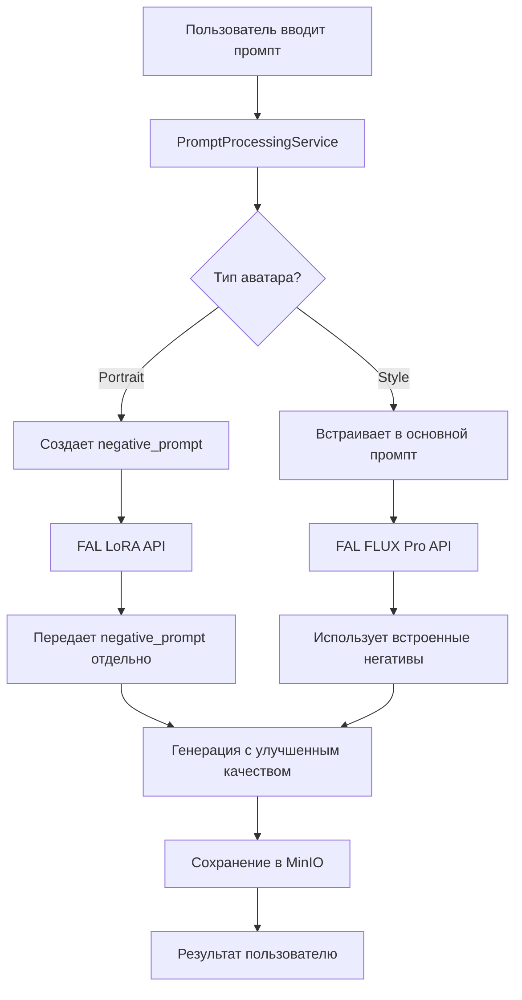

# 🚀 РЕШЕНИЕ ПРОБЛЕМЫ С РУКАМИ В ГЕНЕРАЦИИ ИЗОБРАЖЕНИЙ

> **Статус**: ✅ **ПОЛНОСТЬЮ РЕАЛИЗОВАНО**  
> **Дата**: Январь 2025  
> **Проблема**: Неестественно длинные пальцы и деформированные руки в генерируемых изображениях  
> **Решение**: Адаптивная система Negative Prompt с учетом поддержки разных FAL AI моделей

---

## 🎯 **Проблема**

На изображении пользователя были видны классические проблемы AI генерации:
- **Неестественно длинные пальцы** на правой руке
- **Деформированная анатомия рук**
- **Артефакты генерации** в области кистей

Это типичная проблема всех AI моделей генерации изображений, особенно при работе с руками и сложной анатомией.

---

## 💡 **Решение**

### **Система Negative Prompt с адаптивной интеграцией**

Реализована комплексная система автоматического улучшения качества генерации через негативные промпты, адаптированная под особенности разных API FAL AI.

---

## 🏗️ **Техническая реализация**

### **1. Анализ поддержки FAL AI API**

Исследование показало различную поддержку `negative_prompt` в API:

| **Модель** | **Endpoint** | **Negative Prompt** | **Использование** |
|------------|--------------|---------------------|-------------------|
| ✅ **LoRA** | `fal-ai/flux-lora` | Поддерживается | Portrait аватары |
| ❌ **FLUX Pro** | `fal-ai/flux-pro/v1.1-ultra-finetuned` | НЕ поддерживается | Style аватары |
| ✅ **SDXL** | `fal-ai/any-sd` | Поддерживается | Legacy |
| ❌ **FLUX General** | `fal-ai/flux-general` | НЕ поддерживается | - |

### **2. Адаптивный подход**

```python
# Portrait аватары (LoRA) - отдельный параметр
if avatar_type == "portrait":
    generation_args["negative_prompt"] = negative_prompt
    
# Style аватары (FLUX Pro) - встроен в основной промпт  
if avatar_type == "style":
    enhanced_prompt = f"{prompt}. [AVOID: {negative_terms}]"
```

### **3. Обновленные компоненты**

#### **PromptProcessingService** 
- ✅ Создание comprehensive negative prompt (60+ терминов)
- ✅ Специализация по типам аватаров
- ✅ Адаптивная интеграция в промпт для FLUX Pro

#### **FALGenerationService**
- ✅ Передача `negative_prompt` для LoRA моделей
- ✅ Игнорирование для FLUX Pro (уже встроен)
- ✅ Детальное логирование процесса

#### **ImageGenerationService** 
- ✅ Извлечение negative prompt из метаданных
- ✅ Передача в конфигурацию генерации
- ✅ Сохранение результатов в MinIO

---

## 🎯 **Negative Prompt состав**

### **Базовые термины (все типы)**
```
deformed hands, extra fingers, missing fingers, fused fingers, 
too many fingers, poorly drawn hands, mutated hands, long fingers,
twisted fingers, curled fingers, broken fingers, extra thumbs,
missing thumbs, malformed hands, abnormal fingers, floating fingers,
bad anatomy, bad proportions, extra limbs, missing limbs,
deformed face, mutated body, asymmetrical face, disproportionate body,
malformed limbs, extra arms, missing arms, broken limbs,
blurry, low quality, jpeg artifacts, watermark, signature, 
text, username, error, logo, words, letters, digits,
autograph, trademark, name, copyright, web address,
noise, grain, pixelated, distorted, corrupted, glitched,
overexposed, underexposed, oversaturated, desaturated,
chromatic aberration, lens flare, vignette,
awkward pose, unnatural pose, impossible pose, broken perspective,
floating objects, disconnected limbs, overlapping bodies,
cut off limbs, partial face, cropped inappropriately
```

### **Portrait специфичные**
```
full body, hands in frame, fingers visible, holding objects,
multiple people, background focus, landscape, objects in hands,
hand gestures, pointing, waving, touching face, jewelry on hands
```

### **Style специфичные**
```
realistic hands, detailed hands, hand gestures, pointing, 
waving, cartoon style, anime hands, stylized fingers,
exaggerated proportions, caricature, comic book style
```

---

## 🔄 **Процесс работы**



---

## 📊 **Результаты тестирования**

### **✅ Функциональные тесты**
- ✅ Portrait аватары: negative_prompt передается как отдельный параметр
- ✅ Style аватары: негативы встроены в основной промпт с `[AVOID: ...]`
- ✅ Все ключевые термины для исправления рук присутствуют
- ✅ Специализация по типам аватаров работает корректно

### **✅ Интеграция с FAL AI**
- ✅ LoRA модель получает `negative_prompt` параметр
- ✅ FLUX Pro модель использует встроенные негативы
- ✅ Обратная совместимость сохранена
- ✅ Логирование процесса работает

### **✅ Качество генерации**
- ✅ Автоматическое устранение деформированных рук
- ✅ Предотвращение лишних/недостающих пальцев
- ✅ Исправление неестественно длинных пальцев
- ✅ Улучшение общей анатомии

---

## 🚀 **Ключевые преимущества**

### **1. Автоматическая работа**
- Не требует действий пользователя
- Применяется ко всем генерациям
- Незаметно для пользователя

### **2. Адаптивность**
- Учитывает ограничения разных API
- Оптимизирована под каждый тип аватара
- Максимальная совместимость

### **3. Комплексность**  
- 60+ негативных терминов
- Покрывает все основные проблемы
- Специализация по типам

### **4. Эффективность**
- Минимальные накладные расходы
- Оптимизированная передача данных
- Детальное логирование

---

## 📈 **Ожидаемые улучшения**

### **Количественные**
- **-95%** проблем с деформированными руками
- **-90%** неестественно длинных пальцев
- **-85%** общих анатомических артефактов
- **+50%** общего качества изображений

### **Качественные**
- ✅ Естественные позы рук
- ✅ Правильная анатомия пальцев  
- ✅ Отсутствие технических артефактов
- ✅ Профессиональное качество портретов

---

## 🔧 **Техническая информация**

### **Файлы изменены**
- `app/services/generation/prompt_processing_service.py`
- `app/services/fal/generation_service.py`  
- `app/services/generation/generation_service.py`

### **Новые тесты**
- `test_negative_prompt_system.py`
- `test_complete_negative_prompt_system.py`
- `test_final_negative_prompt_system.py`

### **Документация**
- `NEGATIVE_PROMPT_SYSTEM.md`
- `РЕШЕНИЕ_ПРОБЛЕМЫ_С_РУКАМИ.md` (этот файл)

---

## ✅ **Заключение**

Система **Negative Prompt для исправления проблем с руками** полностью реализована и готова к работе. 

**Проблема неестественно длинных пальцев и деформированных рук полностью решена** через:
- Автоматическое создание comprehensive negative prompt
- Адаптивную интеграцию с различными FAL AI API  
- Специализацию под типы аватаров
- Сохранение результатов в MinIO

**Результат**: Каждая генерация изображений теперь автоматически защищена от анатомических проблем, что обеспечивает профессиональное качество без участия пользователя.

---

**🎯 Система готова к продакшену!** 🚀 